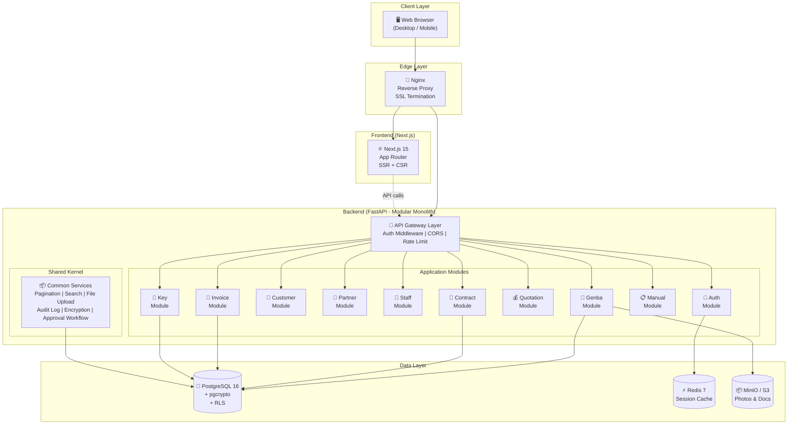
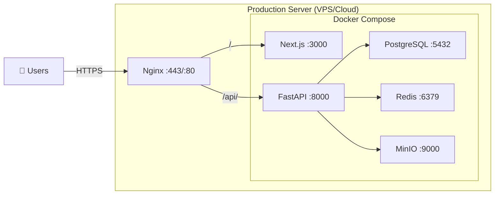
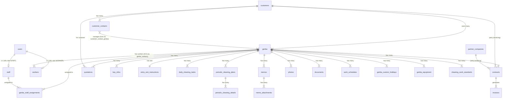

# THIẾT KẾ KIẾN TRÚC & ĐẶC TẢ KỸ THUẬT — HỆ THỐNG QUẢN LÝ GENBA

**Phiên bản:** 1.0  
**Ngày tạo:** 2026-06-10  
**Tác giả:** Solution Architect  
**Trạng thái:** Draft — Chờ review  
**Tài liệu tham chiếu:** BA Part 1–3 + Stakeholder Feedback (Comments)

---

## CHANGELOG — TỔNG HỢP ĐIỀU CHỈNH TỪ FEEDBACK

Trước khi đi vào thiết kế, dưới đây là tổng hợp toàn bộ thay đổi đã được thống nhất từ comments của stakeholder, được phân nhóm theo chủ đề.

### Thay đổi về Scope & Domain

| # | Nội dung điều chỉnh | Ảnh hưởng |
|---|---------------------|-----------|
| C-01 | **Customer Management mở rộng:** Quản lý thông tin chung công ty (tên, địa chỉ, SĐT, fax, email) + Người đại diện thường xuyên (nhiều người). Customer Contact có thể phụ trách nhiều genba. | Data model Customer, CustomerContact, CustomerContactGenba (N:N) |
| C-02 | **Internal Staff không chỉ là genba manager:** Bao gồm giám đốc, kế toán, thủ thư... → Cần trường `position/role_type` | Data model Staff, RBAC |
| C-03 | **Thêm vai trò Senior Staff (管理職):** Xem doanh thu, lợi nhuận, tình hình tổng thể | Thêm role vào RBAC |
| C-04 | **実習生 là Worker bình thường:** Không cần phân loại đặc biệt | Đơn giản hóa Worker model |
| C-05 | **Worker ↔ Genba là N:N:** Một worker có thể làm việc tại nhiều genba | Bảng trung gian `genba_workers` |
| C-06 | **Genba có main staff + sub staff:** Ngoài staff chính, có thể thêm nhiều sub staff | Bảng `genba_staff_assignments` |
| C-07 | **Bỏ cột 優先順位** | Xóa field priority khỏi Genba |
| C-08 | **MCD = mã genba từ hệ thống đối tác:** Lưu tùy chọn, cho phép không điền | Giữ field `external_partner_code`, optional |

### Thay đổi về Contract & Finance

| # | Nội dung điều chỉnh | Ảnh hưởng |
|---|---------------------|-----------|
| C-09 | **1 genba có nhiều HĐ cùng loại DV cho khu vực khác nhau:** VD nhiều HĐ 日常清掃 cho 共用部, 専用部 | Thêm field `service_area` vào Contract |
| C-10 | **Contract có 2 loại mã:** (1) Mã nội bộ Shinsei tự tạo, (2) Mã từ hệ thống KH | Tách thành `internal_code` (auto) + `external_code` (manual) |
| C-11 | **Contract thêm fields:** Loại vệ sinh, nội dung công việc | Thêm `cleaning_type`, `work_description` |
| C-12 | **Invoice tự động tạo hàng tháng:** Dựa trên HĐ → tự động generate → user confirm/edit | Auto-generation service, cron job |
| C-13 | **Cần approval workflow:** Cho báo giá, hợp đồng, hóa đơn | Bảng `approval_workflows`, `approval_steps` |

### Thay đổi về Schedule & Operation

| # | Nội dung điều chỉnh | Ảnh hưởng |
|---|---------------------|-----------|
| C-14 | **Cho phép thêm ngày nghỉ riêng per genba:** Ngoài lễ cố định | Bảng `genba_custom_holidays` |
| C-15 | **Lịch thay đổi theo ngày trong tuần:** Thứ 2 làm khác Thứ 5 | Daily Cleaning Task cần `day_of_week` field |
| C-16 | **Holiday shift rule:** Trúng ngày nghỉ → dồn sang ngày kế tiếp | Logic xử lý schedule, field `holiday_shift_rule` |
| C-17 | **Periodic cleaning team = đối tác hoặc tự làm** | Field `work_team_type` (SELF/PARTNER), FK optional partner_id |
| C-18 | **Quản lý dụng cụ vệ sinh per genba** | Bảng `genba_equipment` |
| C-19 | **Số hóa bảng tiêu chuẩn công việc (基準表)** | Bảng `cleaning_work_standards` |

### Thay đổi về Memo, Photo & Partner

| # | Nội dung điều chỉnh | Ảnh hưởng |
|---|---------------------|-----------|
| C-20 | **Memo hỗ trợ đính kèm ảnh/file** | Bảng `memo_attachments` |
| C-21 | **Partner có thể upload ảnh làm việc** | Permission: Partner có quyền upload ảnh loại "work_report" |
| C-22 | **Partner xem được:** 定期マニュアル, 入退館, 現場写真 | Cập nhật permission matrix |

### Thay đổi về NFR & Xác nhận OQ

| # | Nội dung điều chỉnh | Giá trị |
|---|---------------------|---------|
| C-23 | Quy mô user | **5,000 user** |
| C-24 | Maintenance window | **00:00–05:00 JST** |
| C-25 | Giao diện | **Hoàn toàn tiếng Nhật** |
| C-26 | Customer truy cập hệ thống | **Chưa cần MVP, nhưng xây sẵn nền tảng** |
| C-27 | Genba = 1 tòa nhà/địa điểm | **Nhiều dịch vụ cùng 1 genba, tách biệt HĐ** |
| C-28 | Export Excel/PDF | **Chưa cần MVP** |
| C-29 | Payment gateway | **Không cần** |
| C-30 | Đa ngôn ngữ, đa timezone | **Không cần** |
| C-31 | Self-registration | **Không cần** |
| C-32 | Notification | **Không cần** |

---

## 1. ĐỀ XUẤT TECH STACK

### 1.1. Tổng quan quyết định

| Layer | Công nghệ | Phiên bản | Lý do |
|-------|-----------|-----------|-------|
| **Frontend** | **Next.js** (React) | 15.x | SSR/SSG cho SEO; App Router; cộng đồng lớn; hỗ trợ i18n tốt (tiếng Nhật); TypeScript native |
| **UI Library** | **shadcn/ui** + Radix UI | Latest | Accessible components; dễ customize cho tiếng Nhật; responsive mobile-first |
| **State Management** | **TanStack Query** (React Query) | 5.x | Server state management; caching; optimistic updates; giảm boilerplate |
| **Backend** | **FastAPI** (Python) | 0.115+ | Async native; auto-generated OpenAPI docs; type hints; dễ mở rộng AI/ML tương lai; performance tốt |
| **ORM** | **SQLAlchemy** 2.0 + **Alembic** | 2.0+ | Mature ORM; migration tool; hỗ trợ PostgreSQL native; async support |
| **Database** | **PostgreSQL** | 16+ | ACID; JSONB cho dữ liệu linh hoạt; Row-Level Security (RLS) cho phân quyền; Full-text search tiếng Nhật |
| **Object Storage** | **MinIO** (self-hosted) hoặc **AWS S3** | Latest | Lưu ảnh, tài liệu; presigned URLs; tương thích S3 API |
| **Cache** | **Redis** | 7+ | Session storage; cache danh sách genba; rate limiting |
| **Authentication** | **JWT** + **bcrypt** | — | Stateless auth; role-based claims; refresh token rotation |
| **Reverse Proxy** | **Nginx** | 1.25+ | SSL termination; static file serving; load balancing |
| **Containerization** | **Docker** + **Docker Compose** | Latest | Consistent dev/prod environment; dễ deploy |

### 1.2. Lý do chi tiết

#### Tại sao FastAPI thay vì Django?

| Tiêu chí | FastAPI | Django |
|----------|---------|--------|
| **Performance** | Async native, ASGI → nhanh hơn ~3x | Sync WSGI mặc định |
| **API-first** | Sinh ra để làm API; auto OpenAPI docs | Django REST Framework là add-on |
| **Type safety** | Pydantic validation built-in | Serializers tách biệt |
| **Flexibility** | Tự chọn ORM, auth → phù hợp Clean Architecture | Monolithic framework, khó tách |
| **AI/ML tương lai** | Cùng ecosystem Python; dễ tích hợp | Cũng Python nhưng sync-heavy |
| **Learning curve** | Nhỏ hơn, ít magic | Lớn hơn nhưng "batteries included" |

> [!IMPORTANT]
> **Quyết định:** FastAPI phù hợp hơn cho dự án này vì: (1) API-first design cho multi-client (web + future mobile), (2) async I/O cho file upload, (3) Pydantic cho validation nghiệp vụ phức tạp (hợp đồng, hoá đơn), (4) tương lai tích hợp AI/OCR dễ dàng.

#### Tại sao PostgreSQL?

1. **Row-Level Security (RLS):** Enforce phân quyền ở tầng database → Partner chỉ thấy genba có HĐ, Worker chỉ thấy genba assigned → không thể bypass từ application layer
2. **JSONB:** Linh hoạt cho dữ liệu manual (rich text), dụng cụ vệ sinh, holiday rules
3. **Full-text search tiếng Nhật:** Hỗ trợ extension `pg_bigm` hoặc `pg_trgm` cho tìm kiếm tiếng Nhật
4. **pgcrypto:** Mã hoá mã chìa khoá, keybanker trực tiếp trong DB
5. **Mature:** Cộng đồng lớn, documentation tốt, proven ở enterprise scale

#### Tại sao Next.js thay vì React SPA thuần?

1. **Server-Side Rendering:** Trang chi tiết genba với nhiều ảnh load nhanh hơn
2. **API Routes:** Có thể dùng làm BFF (Backend-for-Frontend) proxy
3. **App Router:** Layout nested → phù hợp cho trang detail genba nhiều tab
4. **Image Optimization:** Built-in cho ảnh hiện trường
5. **i18n:** Route-based internationalization → đơn giản cho UI hoàn toàn tiếng Nhật

---

## 2. KIẾN TRÚC TỔNG THỂ (High-Level Architecture)

### 2.1. Mô hình: Modular Monolith + Clean Architecture

**Lý do chọn Modular Monolith cho MVP:**

| Tiêu chí | Modular Monolith | Microservices |
|----------|-----------------|---------------|
| Chi phí triển khai | Thấp (1 server) | Cao (nhiều service, orchestration) |
| Complexity | Vừa phải | Rất cao |
| Team size phù hợp | 2–5 devs | 5+ devs per service |
| Tách module về sau | ✅ Dễ dàng nếu thiết kế đúng | — |
| Scale cho 5,000 users | ✅ Đủ | Overkill |
| Transaction across modules | Đơn giản (local) | Saga pattern (phức tạp) |

### 2.2. Sơ đồ kiến trúc tổng thể



### 2.3. Clean Architecture per Module

Mỗi module bên trong monolith tuân theo cấu trúc **Clean Architecture** (Hexagonal):

```
backend/
├── app/
│   ├── main.py                    # FastAPI app entry
│   ├── core/                      # Shared Kernel
│   │   ├── config.py              # Settings
│   │   ├── security.py            # JWT, bcrypt, encryption
│   │   ├── database.py            # DB session
│   │   ├── dependencies.py        # DI container
│   │   ├── pagination.py          # Shared pagination
│   │   ├── audit.py               # Audit log service
│   │   ├── approval.py            # Approval workflow engine
│   │   └── exceptions.py          # Custom exceptions
│   │
│   ├── modules/
│   │   ├── auth/
│   │   │   ├── router.py          # API endpoints
│   │   │   ├── schemas.py         # Pydantic models (Request/Response)
│   │   │   ├── service.py         # Business logic
│   │   │   ├── repository.py      # Database operations
│   │   │   └── models.py          # SQLAlchemy models
│   │   │
│   │   ├── genba/
│   │   │   ├── router.py
│   │   │   ├── schemas.py
│   │   │   ├── service.py
│   │   │   ├── repository.py
│   │   │   └── models.py
│   │   │
│   │   ├── customer/              # Same structure
│   │   ├── partner/
│   │   ├── staff/
│   │   ├── contract/
│   │   ├── quotation/
│   │   ├── invoice/
│   │   ├── manual/
│   │   └── key_management/
│   │
│   └── migrations/                # Alembic migrations
│
├── tests/
├── docker-compose.yml
├── Dockerfile
└── pyproject.toml
```

### 2.4. Deployment Architecture



> [!TIP]
> **MVP giai đoạn đầu:** Deploy tất cả trên 1 VPS (4 vCPU, 8GB RAM) bằng Docker Compose là đủ cho 5,000 users. Khi cần scale → tách database sang managed service (RDS), object storage sang S3.

---

## 3. THIẾT KẾ CƠ SỞ DỮ LIỆU (Database Schema)

### 3.1. ER Diagram — Tổng quan



### 3.2. DDL — Chi tiết từng bảng

#### 3.2.1. Platform Layer

```sql
-- =============================================
-- USERS & AUTHENTICATION
-- =============================================
CREATE TABLE users (
    id              UUID PRIMARY KEY DEFAULT gen_random_uuid(),
    username        VARCHAR(50) UNIQUE NOT NULL,
    password_hash   VARCHAR(256) NOT NULL,
    role            VARCHAR(20) NOT NULL CHECK (role IN (
                        'ADMIN', 'SENIOR_STAFF', 'INTERNAL_STAFF', 
                        'GENBA_WORKER', 'CUSTOMER', 'PARTNER'
                    )),
    display_name    VARCHAR(100) NOT NULL,
    is_active       BOOLEAN DEFAULT TRUE,
    locked_until    TIMESTAMP,
    failed_login_count INTEGER DEFAULT 0,
    last_login_at   TIMESTAMP,
    
    -- Liên kết tới entity cụ thể theo role
    related_staff_id    UUID REFERENCES staff(id),
    related_worker_id   UUID REFERENCES workers(id),
    related_customer_id UUID REFERENCES customers(id),
    related_partner_id  UUID REFERENCES partner_companies(id),
    
    created_at      TIMESTAMP DEFAULT NOW(),
    updated_at      TIMESTAMP DEFAULT NOW()
);

-- =============================================
-- AUDIT LOG
-- =============================================
CREATE TABLE audit_logs (
    id              UUID PRIMARY KEY DEFAULT gen_random_uuid(),
    user_id         UUID REFERENCES users(id),
    action          VARCHAR(20) NOT NULL, -- CREATE, UPDATE, DELETE, VIEW
    entity_type     VARCHAR(50) NOT NULL, -- genba, contract, key_info, etc.
    entity_id       UUID NOT NULL,
    old_value       JSONB,               -- Giá trị trước khi thay đổi
    new_value       JSONB,               -- Giá trị sau khi thay đổi
    ip_address      INET,
    user_agent      TEXT,
    is_sensitive    BOOLEAN DEFAULT FALSE, -- TRUE cho key_info access
    created_at      TIMESTAMP DEFAULT NOW()
);
CREATE INDEX idx_audit_logs_entity ON audit_logs(entity_type, entity_id);
CREATE INDEX idx_audit_logs_user ON audit_logs(user_id, created_at);

-- =============================================
-- APPROVAL WORKFLOW
-- =============================================
CREATE TABLE approval_requests (
    id              UUID PRIMARY KEY DEFAULT gen_random_uuid(),
    entity_type     VARCHAR(50) NOT NULL, -- quotation, contract, invoice
    entity_id       UUID NOT NULL,
    requested_by    UUID REFERENCES users(id) NOT NULL,
    status          VARCHAR(20) DEFAULT 'PENDING' CHECK (status IN (
                        'PENDING', 'APPROVED', 'REJECTED'
                    )),
    approved_by     UUID REFERENCES users(id),
    approved_at     TIMESTAMP,
    comment         TEXT,
    created_at      TIMESTAMP DEFAULT NOW()
);
```

#### 3.2.2. Party Domain

```sql
-- =============================================
-- CUSTOMERS (取引先)
-- =============================================
CREATE TABLE customers (
    id              UUID PRIMARY KEY DEFAULT gen_random_uuid(),
    full_name       VARCHAR(200) NOT NULL, -- 日本ハウズイング株式会社
    short_name      VARCHAR(100) NOT NULL, -- ハウズビル不
    branch_name     VARCHAR(100),          -- 大阪北支店
    phone           VARCHAR(20),
    fax             VARCHAR(20),
    email           VARCHAR(100),
    address         VARCHAR(500),
    notes           TEXT,
    is_active       BOOLEAN DEFAULT TRUE,
    created_at      TIMESTAMP DEFAULT NOW(),
    updated_at      TIMESTAMP DEFAULT NOW()
);

-- =============================================
-- CUSTOMER CONTACTS (取引先担当者) — Đại diện KH
-- =============================================
CREATE TABLE customer_contacts (
    id              UUID PRIMARY KEY DEFAULT gen_random_uuid(),
    customer_id     UUID REFERENCES customers(id) NOT NULL,
    full_name       VARCHAR(100) NOT NULL,      -- 樋口, 高木
    position        VARCHAR(100),               -- Chức vụ
    phone           VARCHAR(20),
    email           VARCHAR(100),
    notes           TEXT,
    is_primary      BOOLEAN DEFAULT FALSE,      -- Người liên hệ chính
    is_active       BOOLEAN DEFAULT TRUE,
    created_at      TIMESTAMP DEFAULT NOW(),
    updated_at      TIMESTAMP DEFAULT NOW()
);

-- N:N Customer Contact ↔ Genba (1 người phụ trách nhiều genba)
CREATE TABLE customer_contact_genba (
    customer_contact_id UUID REFERENCES customer_contacts(id) NOT NULL,
    genba_id            UUID REFERENCES genba(id) NOT NULL,
    PRIMARY KEY (customer_contact_id, genba_id)
);

-- =============================================
-- PARTNER COMPANIES (協力会社)
-- =============================================
CREATE TABLE partner_companies (
    id              UUID PRIMARY KEY DEFAULT gen_random_uuid(),
    company_name    VARCHAR(200) NOT NULL,  -- BePro, マルクリーン
    phone           VARCHAR(20),
    fax             VARCHAR(20),
    email           VARCHAR(100),
    address         VARCHAR(500),
    contact_person  VARCHAR(100),           -- Người liên hệ chính
    notes           TEXT,
    is_active       BOOLEAN DEFAULT TRUE,
    created_at      TIMESTAMP DEFAULT NOW(),
    updated_at      TIMESTAMP DEFAULT NOW()
);

-- =============================================
-- INTERNAL STAFF (社内担当者)
-- =============================================
CREATE TABLE staff (
    id              UUID PRIMARY KEY DEFAULT gen_random_uuid(),
    full_name       VARCHAR(100) NOT NULL,  -- 久保, 山中
    position        VARCHAR(50),            -- 担当, 部長, 経理, etc.
    phone           VARCHAR(20),
    email           VARCHAR(100),
    is_active       BOOLEAN DEFAULT TRUE,
    created_at      TIMESTAMP DEFAULT NOW(),
    updated_at      TIMESTAMP DEFAULT NOW()
);

-- =============================================
-- GENBA WORKERS (現場員)
-- =============================================
CREATE TABLE workers (
    id              UUID PRIMARY KEY DEFAULT gen_random_uuid(),
    full_name       VARCHAR(100) NOT NULL,  -- 安彦, 武田
    phone           VARCHAR(20),
    email           VARCHAR(100),
    birth_date      DATE,
    notes           TEXT,
    is_active       BOOLEAN DEFAULT TRUE,
    created_at      TIMESTAMP DEFAULT NOW(),
    updated_at      TIMESTAMP DEFAULT NOW()
);
```

#### 3.2.3. Core Business Domain

```sql
-- =============================================
-- GENBA (現場) — Central Entity
-- =============================================
CREATE TABLE genba (
    id                  UUID PRIMARY KEY DEFAULT gen_random_uuid(),
    property_name       VARCHAR(200) NOT NULL,   -- 物件名
    address             VARCHAR(500) NOT NULL,   -- 住所
    transportation      TEXT,                    -- 交通機関
    phone               VARCHAR(20),
    
    -- Mã bên ngoài
    external_partner_code VARCHAR(20),            -- MCD: mã từ hệ thống đối tác
    
    -- Trạng thái
    status              VARCHAR(20) DEFAULT 'ACTIVE' CHECK (status IN ('ACTIVE', 'TERMINATED')),
    site_confirmed      BOOLEAN DEFAULT FALSE,    -- 現場確認
    manual_created      BOOLEAN DEFAULT FALSE,    -- マニュアル作成
    
    -- Quan hệ
    customer_id         UUID REFERENCES customers(id) NOT NULL,
    
    -- Metadata
    special_notes       TEXT,
    management_start_date DATE,                   -- 管理開始日
    terminated_at       TIMESTAMP,                -- Ngày kết thúc
    created_at          TIMESTAMP DEFAULT NOW(),
    updated_at          TIMESTAMP DEFAULT NOW()
);

CREATE INDEX idx_genba_customer ON genba(customer_id);
CREATE INDEX idx_genba_status ON genba(status);

-- N:N Genba ↔ Staff (main + sub staff)
CREATE TABLE genba_staff_assignments (
    id          UUID PRIMARY KEY DEFAULT gen_random_uuid(),
    genba_id    UUID REFERENCES genba(id) NOT NULL,
    staff_id    UUID REFERENCES staff(id) NOT NULL,
    role_type   VARCHAR(20) DEFAULT 'MAIN' CHECK (role_type IN ('MAIN', 'SUB')),
    assigned_at TIMESTAMP DEFAULT NOW(),
    UNIQUE(genba_id, staff_id)
);

-- N:N Genba ↔ Workers
CREATE TABLE genba_workers (
    id          UUID PRIMARY KEY DEFAULT gen_random_uuid(),
    genba_id    UUID REFERENCES genba(id) NOT NULL,
    worker_id   UUID REFERENCES workers(id) NOT NULL,
    assigned_at TIMESTAMP DEFAULT NOW(),
    removed_at  TIMESTAMP,
    is_active   BOOLEAN DEFAULT TRUE,
    UNIQUE(genba_id, worker_id)
);
```

#### 3.2.4. Contract & Finance Domain

```sql
-- =============================================
-- CONTRACTS (契約)
-- =============================================
CREATE TABLE contracts (
    id                  UUID PRIMARY KEY DEFAULT gen_random_uuid(),
    
    -- Mã hợp đồng kép
    internal_code       VARCHAR(50) UNIQUE NOT NULL,  -- Shinsei auto-generate
    external_code       VARCHAR(50),                   -- Mã từ hệ thống KH
    
    contract_type       VARCHAR(20) NOT NULL CHECK (contract_type IN ('RECEIVING', 'ORDERING')),
                        -- RECEIVING = 受注 (từ KH), ORDERING = 発注 (cho ĐT)
    
    -- Nội dung dịch vụ
    service_type        VARCHAR(50) NOT NULL,           -- 日常清掃, 定期清掃, 管理員, etc.
    service_area        VARCHAR(100),                   -- 共用部, 専用部, etc.
    cleaning_type       VARCHAR(100),                   -- Loại vệ sinh chi tiết
    work_description    TEXT,                           -- Nội dung công việc
    
    -- Tài chính
    amount              DECIMAL(12,2) NOT NULL,         -- 御請求額
    hourly_rate         DECIMAL(10,2),                  -- 時間単価
    tax_type            VARCHAR(10) DEFAULT 'EXCLUSIVE', -- INCLUSIVE, EXCLUSIVE
    
    -- Thời hạn
    start_date          DATE NOT NULL,                  -- 契約開始
    end_date            DATE,                           -- 契約終了
    auto_renew          BOOLEAN DEFAULT FALSE,
    
    -- Cờ nghiệp vụ
    invoice_required    BOOLEAN DEFAULT TRUE,           -- 請求書発行有無
    
    -- Trạng thái + Duyệt
    status              VARCHAR(20) DEFAULT 'DRAFT' CHECK (status IN (
                            'DRAFT', 'PENDING_APPROVAL', 'ACTIVE', 
                            'EXPIRED', 'CANCELLED'
                        )),
    
    -- Quan hệ
    genba_id            UUID REFERENCES genba(id) NOT NULL,
    customer_id         UUID REFERENCES customers(id),       -- NOT NULL nếu RECEIVING
    partner_id          UUID REFERENCES partner_companies(id), -- NOT NULL nếu ORDERING
    
    created_by          UUID REFERENCES users(id),
    created_at          TIMESTAMP DEFAULT NOW(),
    updated_at          TIMESTAMP DEFAULT NOW(),
    
    -- Constraint: RECEIVING phải có customer, ORDERING phải có partner
    CONSTRAINT chk_contract_party CHECK (
        (contract_type = 'RECEIVING' AND customer_id IS NOT NULL) OR
        (contract_type = 'ORDERING' AND partner_id IS NOT NULL)
    )
);

CREATE INDEX idx_contracts_genba ON contracts(genba_id);
CREATE INDEX idx_contracts_status ON contracts(status);
CREATE INDEX idx_contracts_dates ON contracts(start_date, end_date);

-- =============================================
-- QUOTATIONS (見積書)
-- =============================================
CREATE TABLE quotations (
    id                  UUID PRIMARY KEY DEFAULT gen_random_uuid(),
    quotation_number    VARCHAR(50) UNIQUE NOT NULL,     -- Auto-generated
    title               VARCHAR(200) NOT NULL,
    issue_date          DATE NOT NULL,
    valid_until         DATE,
    
    total_amount        DECIMAL(12,2) NOT NULL,
    tax_amount          DECIMAL(12,2) DEFAULT 0,
    
    work_cycle          TEXT,               -- 月～金、祝日は休み
    work_hours          VARCHAR(200),       -- 16:00～18:00, 2.0h × 1名
    description         TEXT,
    special_conditions  TEXT,
    
    status              VARCHAR(20) DEFAULT 'DRAFT' CHECK (status IN (
                            'DRAFT', 'PENDING_APPROVAL', 'SENT', 
                            'ACCEPTED', 'REJECTED', 'EXPIRED'
                        )),
    
    genba_id            UUID REFERENCES genba(id) NOT NULL,
    customer_id         UUID REFERENCES customers(id) NOT NULL,
    contract_id         UUID REFERENCES contracts(id),    -- Liên kết sau khi chấp nhận
    
    created_by          UUID REFERENCES users(id),
    created_at          TIMESTAMP DEFAULT NOW(),
    updated_at          TIMESTAMP DEFAULT NOW()
);

CREATE TABLE quotation_items (
    id              UUID PRIMARY KEY DEFAULT gen_random_uuid(),
    quotation_id    UUID REFERENCES quotations(id) ON DELETE CASCADE NOT NULL,
    item_name       VARCHAR(200) NOT NULL,
    quantity        DECIMAL(10,2) NOT NULL,
    unit            VARCHAR(20) NOT NULL,     -- 日, 月, 回, 式
    unit_price      DECIMAL(10,2) NOT NULL,
    subtotal        DECIMAL(12,2) NOT NULL,
    remarks         TEXT,
    sort_order      INTEGER DEFAULT 0
);

-- =============================================
-- INVOICES (請求書) — Tự động tạo hàng tháng
-- =============================================
CREATE TABLE invoices (
    id              UUID PRIMARY KEY DEFAULT gen_random_uuid(),
    invoice_number  VARCHAR(50) UNIQUE NOT NULL,  -- Auto-generated
    
    invoice_type    VARCHAR(20) NOT NULL CHECK (invoice_type IN ('OUTGOING', 'INCOMING')),
                    -- OUTGOING = gửi cho KH, INCOMING = nhận từ ĐT
    
    issue_date      DATE NOT NULL,
    billing_period_year  INTEGER NOT NULL,         -- Năm kỳ thanh toán
    billing_period_month INTEGER NOT NULL,         -- Tháng kỳ thanh toán
    
    amount          DECIMAL(12,2) NOT NULL,
    tax_amount      DECIMAL(12,2) DEFAULT 0,
    
    -- Trạng thái
    status          VARCHAR(20) DEFAULT 'DRAFT' CHECK (status IN (
                        'AUTO_GENERATED', 'DRAFT', 'PENDING_APPROVAL',
                        'ISSUED', 'PAID', 'CANCELLED'
                    )),
    is_auto_generated BOOLEAN DEFAULT FALSE,       -- TRUE nếu system tự tạo
    
    notes           TEXT,
    attachment_url  TEXT,                           -- File HĐ gốc (cho INCOMING)
    
    contract_id     UUID REFERENCES contracts(id) NOT NULL,
    
    confirmed_by    UUID REFERENCES users(id),     -- Người xác nhận
    confirmed_at    TIMESTAMP,
    created_by      UUID REFERENCES users(id),
    created_at      TIMESTAMP DEFAULT NOW(),
    updated_at      TIMESTAMP DEFAULT NOW(),
    
    -- Đảm bảo không tạo trùng kỳ cho cùng HĐ
    UNIQUE(contract_id, billing_period_year, billing_period_month, invoice_type)
);

CREATE INDEX idx_invoices_contract ON invoices(contract_id);
CREATE INDEX idx_invoices_period ON invoices(billing_period_year, billing_period_month);
```

#### 3.2.5. Operation Domain

```sql
-- =============================================
-- WORK SCHEDULES (勤務スケジュール)
-- =============================================
CREATE TABLE work_schedules (
    id              UUID PRIMARY KEY DEFAULT gen_random_uuid(),
    genba_id        UUID REFERENCES genba(id) NOT NULL,
    
    shift_label     VARCHAR(50),              -- 基本, ca 2, ca 3
    work_days       VARCHAR(50) NOT NULL,     -- "月火水木金" hoặc "月水金"
    start_time      TIME NOT NULL,
    end_time        TIME NOT NULL,
    break_minutes   INTEGER DEFAULT 0,
    times_per_week  INTEGER,                  -- 〇回/週
    hours_per_day   DECIMAL(4,2),             -- 〇時間/日
    
    -- Quy định nghỉ lễ
    holiday_rule    VARCHAR(20) DEFAULT 'OFF' CHECK (holiday_rule IN (
                        'OFF', 'SHIFT_BEFORE', 'SHIFT_AFTER', 'WORK'
                    )),
    obon_work       BOOLEAN DEFAULT FALSE,
    new_year_work   BOOLEAN DEFAULT FALSE,
    holiday_shift_rule VARCHAR(50),           -- "Dồn sang ngày kế tiếp"
    
    created_at      TIMESTAMP DEFAULT NOW(),
    updated_at      TIMESTAMP DEFAULT NOW()
);

-- Ngày nghỉ riêng per genba (linh động)
CREATE TABLE genba_custom_holidays (
    id              UUID PRIMARY KEY DEFAULT gen_random_uuid(),
    genba_id        UUID REFERENCES genba(id) NOT NULL,
    holiday_date    DATE NOT NULL,
    description     VARCHAR(200),
    substitute_date DATE,                     -- Ngày làm bù (nếu có)
    created_at      TIMESTAMP DEFAULT NOW()
);

-- =============================================
-- KEY INFO (鍵情報) — Encrypted
-- =============================================
CREATE TABLE key_infos (
    id                  UUID PRIMARY KEY DEFAULT gen_random_uuid(),
    genba_id            UUID REFERENCES genba(id) NOT NULL,
    key_number          INTEGER NOT NULL,           -- Số thứ tự (NO.)
    key_type            VARCHAR(20) NOT NULL CHECK (key_type IN ('CYLINDER', 'CARD', 'OTHER')),
    
    -- Mã hoá bằng pgcrypto
    key_code_encrypted  BYTEA,                      -- Mã chìa khoá (encrypted)
    usage_location      TEXT,
    storage_location    VARCHAR(20) CHECK (storage_location IN ('WORKER', 'COMPANY', 'SITE')),
    
    -- Keybanker
    keybanker_code_encrypted BYTEA,                 -- Mã keybanker (encrypted)
    keybanker_location       TEXT,
    keybanker_instructions   TEXT,
    
    status              VARCHAR(20) DEFAULT 'ACTIVE' CHECK (status IN ('ACTIVE', 'RETURNED')),
    
    created_at          TIMESTAMP DEFAULT NOW(),
    updated_at          TIMESTAMP DEFAULT NOW()
);

-- =============================================
-- ENTRY/EXIT INSTRUCTIONS (入退館手順)
-- =============================================
CREATE TABLE entry_exit_instructions (
    id              UUID PRIMARY KEY DEFAULT gen_random_uuid(),
    genba_id        UUID REFERENCES genba(id) UNIQUE NOT NULL, -- 1:1
    entry_method    TEXT,               -- Rich text
    exit_method     TEXT,               -- Rich text
    safety_notes    TEXT,
    updated_at      TIMESTAMP DEFAULT NOW()
);

-- =============================================
-- DAILY CLEANING TASKS (日常清掃タスク)
-- =============================================
CREATE TABLE daily_cleaning_tasks (
    id              UUID PRIMARY KEY DEFAULT gen_random_uuid(),
    genba_id        UUID REFERENCES genba(id) NOT NULL,
    day_of_week     VARCHAR(10),            -- NULL=毎日, 月,火,水... (C-15)
    start_time      TIME NOT NULL,
    floor           VARCHAR(50),            -- 1階, 10階～2階
    area_name       VARCHAR(200) NOT NULL,  -- ごみ庫, エントランス
    work_content    TEXT NOT NULL,           -- Rich text, chi tiết
    special_notes   TEXT,
    sort_order      INTEGER DEFAULT 0,
    created_at      TIMESTAMP DEFAULT NOW(),
    updated_at      TIMESTAMP DEFAULT NOW()
);

-- =============================================
-- PERIODIC CLEANING PLANS (定期清掃計画)
-- =============================================
CREATE TABLE periodic_cleaning_plans (
    id              UUID PRIMARY KEY DEFAULT gen_random_uuid(),
    genba_id        UUID REFERENCES genba(id) NOT NULL,
    
    work_team_type  VARCHAR(10) NOT NULL CHECK (work_team_type IN ('SELF', 'PARTNER')),
    partner_id      UUID REFERENCES partner_companies(id),  -- Nếu PARTNER
    work_content    VARCHAR(200) NOT NULL,   -- 床面洗浄, ガラス清掃
    
    -- Lịch 12 tháng (fiscal year: Apr-Mar)
    month_apr       BOOLEAN DEFAULT FALSE,
    month_may       BOOLEAN DEFAULT FALSE,
    month_jun       BOOLEAN DEFAULT FALSE,
    month_jul       BOOLEAN DEFAULT FALSE,
    month_aug       BOOLEAN DEFAULT FALSE,
    month_sep       BOOLEAN DEFAULT FALSE,
    month_oct       BOOLEAN DEFAULT FALSE,
    month_nov       BOOLEAN DEFAULT FALSE,
    month_dec       BOOLEAN DEFAULT FALSE,
    month_jan       BOOLEAN DEFAULT FALSE,
    month_feb       BOOLEAN DEFAULT FALSE,
    month_mar       BOOLEAN DEFAULT FALSE,
    
    special_notes   TEXT,
    created_at      TIMESTAMP DEFAULT NOW(),
    updated_at      TIMESTAMP DEFAULT NOW()
);

CREATE TABLE periodic_cleaning_details (
    id              UUID PRIMARY KEY DEFAULT gen_random_uuid(),
    plan_id         UUID REFERENCES periodic_cleaning_plans(id) ON DELETE CASCADE NOT NULL,
    location        VARCHAR(100) NOT NULL,   -- 1階, 10～2階
    floor_material  VARCHAR(100),            -- Pタイル, 長尺シート, タイルカーペット
    area_name       VARCHAR(200) NOT NULL,   -- エントランス, 廊下
    work_content    TEXT NOT NULL,            -- 床面洗浄作業
    special_notes   TEXT,
    sort_order      INTEGER DEFAULT 0
);

-- =============================================
-- CLEANING WORK STANDARDS (清掃作業基準表) — C-19
-- =============================================
CREATE TABLE cleaning_work_standards (
    id              UUID PRIMARY KEY DEFAULT gen_random_uuid(),
    genba_id        UUID REFERENCES genba(id) NOT NULL,
    
    floor_number    VARCHAR(20) NOT NULL,        -- 1階, 2階
    area_name       VARCHAR(200) NOT NULL,       -- ポーチ及び玄関
    floor_material  VARCHAR(100),                -- Pタイル, 長尺シート
    area_sqm        DECIMAL(8,2),                -- 面積
    
    -- 日常清掃 frequencies (ma trận tần suất)
    daily_tasks     JSONB DEFAULT '{}',          -- {"sweep": "daily", "mop": "daily", "vacuum": "weekly2"}
    -- 定期清掃 frequencies
    periodic_tasks  JSONB DEFAULT '{}',          -- {"floor_wash": "monthly", "wax": "yearly2"}
    
    remarks         TEXT,
    sort_order      INTEGER DEFAULT 0,
    created_at      TIMESTAMP DEFAULT NOW(),
    updated_at      TIMESTAMP DEFAULT NOW()
);

-- =============================================
-- GENBA EQUIPMENT (清掃用具) — C-18
-- =============================================
CREATE TABLE genba_equipment (
    id              UUID PRIMARY KEY DEFAULT gen_random_uuid(),
    genba_id        UUID REFERENCES genba(id) NOT NULL,
    equipment_name  VARCHAR(200) NOT NULL,   -- ハンディー掃除機
    quantity        INTEGER DEFAULT 1,
    notes           TEXT,                    -- 予備バッテリー１個含む
    sort_order      INTEGER DEFAULT 0,
    created_at      TIMESTAMP DEFAULT NOW()
);
```

#### 3.2.6. Document & Memo Domain

```sql
-- =============================================
-- MEMOS (その他メモ) — with attachments (C-20)
-- =============================================
CREATE TABLE memos (
    id              UUID PRIMARY KEY DEFAULT gen_random_uuid(),
    genba_id        UUID REFERENCES genba(id) NOT NULL,
    memo_date       TIMESTAMP NOT NULL,
    content         TEXT NOT NULL,
    created_by      UUID REFERENCES users(id),
    created_at      TIMESTAMP DEFAULT NOW(),
    updated_at      TIMESTAMP DEFAULT NOW()
);

CREATE TABLE memo_attachments (
    id              UUID PRIMARY KEY DEFAULT gen_random_uuid(),
    memo_id         UUID REFERENCES memos(id) ON DELETE CASCADE NOT NULL,
    file_name       VARCHAR(200) NOT NULL,
    file_url        TEXT NOT NULL,
    file_size       INTEGER,
    file_type       VARCHAR(50),             -- image/jpeg, application/pdf
    created_at      TIMESTAMP DEFAULT NOW()
);

-- =============================================
-- PHOTOS (現場写真)
-- =============================================
CREATE TABLE photos (
    id              UUID PRIMARY KEY DEFAULT gen_random_uuid(),
    genba_id        UUID REFERENCES genba(id) NOT NULL,
    category        VARCHAR(50),             -- 外観, 玄関, エントランス, work_report
    photo_type      VARCHAR(20) DEFAULT 'SITE' CHECK (photo_type IN (
                        'SITE', 'WORK_REPORT'   -- C-21: Partner có thể upload WORK_REPORT
                    )),
    caption         TEXT,
    file_url        TEXT NOT NULL,
    file_size       INTEGER,
    uploaded_by     UUID REFERENCES users(id),
    created_at      TIMESTAMP DEFAULT NOW()
);

CREATE INDEX idx_photos_genba ON photos(genba_id);

-- =============================================
-- DOCUMENTS (文書 — Tài liệu đính kèm)
-- =============================================
CREATE TABLE documents (
    id              UUID PRIMARY KEY DEFAULT gen_random_uuid(),
    genba_id        UUID REFERENCES genba(id) NOT NULL,
    doc_type        VARCHAR(50),             -- 作業基準表, 鍵預かり書, 予定表
    file_name       VARCHAR(200) NOT NULL,
    file_url        TEXT NOT NULL,
    file_size       INTEGER,
    uploaded_by     UUID REFERENCES users(id),
    created_at      TIMESTAMP DEFAULT NOW()
);
```

### 3.3. Row-Level Security (RLS) — Phân quyền ở tầng Database

```sql
-- Bật RLS cho bảng genba
ALTER TABLE genba ENABLE ROW LEVEL SECURITY;

-- Policy: Admin & Senior Staff xem tất cả
CREATE POLICY admin_all_genba ON genba
    FOR ALL TO authenticated_user
    USING (
        current_setting('app.user_role') IN ('ADMIN', 'SENIOR_STAFF', 'INTERNAL_STAFF')
    );

-- Policy: Partner chỉ xem genba có HĐ giao
CREATE POLICY partner_genba ON genba
    FOR SELECT TO authenticated_user
    USING (
        current_setting('app.user_role') = 'PARTNER'
        AND id IN (
            SELECT c.genba_id FROM contracts c
            WHERE c.partner_id = current_setting('app.related_entity_id')::UUID
            AND c.status = 'ACTIVE'
        )
    );

-- Policy: Worker chỉ xem genba được assign
CREATE POLICY worker_genba ON genba
    FOR SELECT TO authenticated_user
    USING (
        current_setting('app.user_role') = 'GENBA_WORKER'
        AND id IN (
            SELECT gw.genba_id FROM genba_workers gw
            WHERE gw.worker_id = current_setting('app.related_entity_id')::UUID
            AND gw.is_active = TRUE
        )
    );
```

---

## 4. DANH SÁCH API CỐT LÕI (RESTful API Endpoints)

### 4.1. Convention

- Base URL: `/api/v1/`
- Authentication: `Bearer <JWT>` header
- Response format: `{ "data": {...}, "meta": {...}, "errors": [...] }`
- Pagination: `?page=1&per_page=20&sort_by=created_at&sort_order=desc`
- Filters: Query params `?status=ACTIVE&customer_id=xxx`

### 4.2. Auth Module

| Method | Endpoint | Description | Role |
|--------|----------|-------------|------|
| `POST` | `/api/v1/auth/login` | Đăng nhập, trả về access_token + refresh_token | Public |
| `POST` | `/api/v1/auth/refresh` | Refresh access token | Authenticated |
| `POST` | `/api/v1/auth/logout` | Vô hiệu hóa refresh token | Authenticated |
| `PUT` | `/api/v1/auth/password` | Đổi mật khẩu bản thân | Authenticated |
| `GET` | `/api/v1/auth/me` | Thông tin user hiện tại | Authenticated |

### 4.3. User Management

| Method | Endpoint | Description | Role |
|--------|----------|-------------|------|
| `GET` | `/api/v1/users` | Danh sách users | Admin |
| `POST` | `/api/v1/users` | Tạo user mới | Admin |
| `GET` | `/api/v1/users/{id}` | Chi tiết user | Admin |
| `PUT` | `/api/v1/users/{id}` | Cập nhật user | Admin |
| `DELETE` | `/api/v1/users/{id}` | Vô hiệu hóa user (soft delete) | Admin |
| `POST` | `/api/v1/users/{id}/reset-password` | Reset mật khẩu | Admin |

### 4.4. Genba Module

| Method | Endpoint | Description | Role |
|--------|----------|-------------|------|
| `GET` | `/api/v1/genba` | Danh sách genba (filter: status, customer, staff) | Staff+, Worker (scoped), Partner (scoped) |
| `POST` | `/api/v1/genba` | Tạo genba mới | Admin, Staff |
| `GET` | `/api/v1/genba/{id}` | Chi tiết genba (response tuỳ role) | All (scoped) |
| `PUT` | `/api/v1/genba/{id}` | Cập nhật genba | Admin, Staff |
| `PATCH` | `/api/v1/genba/{id}/terminate` | Chuyển trạng thái "Kết thúc" | Admin, Staff |
| `GET` | `/api/v1/genba/{id}/staff` | DS staff assigned cho genba | Admin, Staff |
| `POST` | `/api/v1/genba/{id}/staff` | Gán staff (main/sub) cho genba | Admin, Staff |
| `DELETE` | `/api/v1/genba/{id}/staff/{staffId}` | Xoá staff assignment | Admin, Staff |
| `GET` | `/api/v1/genba/{id}/workers` | DS worker tại genba | Admin, Staff |
| `POST` | `/api/v1/genba/{id}/workers` | Gán worker cho genba | Admin, Staff |
| `DELETE` | `/api/v1/genba/{id}/workers/{workerId}` | Xoá worker assignment | Admin, Staff |

### 4.5. Customer Module

| Method | Endpoint | Description | Role |
|--------|----------|-------------|------|
| `GET` | `/api/v1/customers` | Danh sách khách hàng | Admin, Staff |
| `POST` | `/api/v1/customers` | Tạo KH mới | Admin, Staff |
| `GET` | `/api/v1/customers/{id}` | Chi tiết KH + danh sách genba | Admin, Staff |
| `PUT` | `/api/v1/customers/{id}` | Cập nhật KH | Admin, Staff |
| `GET` | `/api/v1/customers/{id}/contacts` | DS người liên hệ | Admin, Staff |
| `POST` | `/api/v1/customers/{id}/contacts` | Thêm người liên hệ | Admin, Staff |
| `PUT` | `/api/v1/customers/{id}/contacts/{cid}` | Cập nhật liên hệ | Admin, Staff |
| `DELETE` | `/api/v1/customers/{id}/contacts/{cid}` | Xoá liên hệ | Admin |

### 4.6. Partner Module

| Method | Endpoint | Description | Role |
|--------|----------|-------------|------|
| `GET` | `/api/v1/partners` | Danh sách đối tác | Admin, Staff |
| `POST` | `/api/v1/partners` | Tạo đối tác mới | Admin, Staff |
| `GET` | `/api/v1/partners/{id}` | Chi tiết đối tác + DS genba liên kết | Admin, Staff, Partner (self) |
| `PUT` | `/api/v1/partners/{id}` | Cập nhật đối tác | Admin, Staff |

### 4.7. Staff & Worker Module

| Method | Endpoint | Description | Role |
|--------|----------|-------------|------|
| `GET` | `/api/v1/staff` | Danh sách staff nội bộ | Admin, SeniorStaff |
| `POST` | `/api/v1/staff` | Tạo staff mới | Admin |
| `GET` | `/api/v1/staff/{id}` | Chi tiết staff + DS genba phụ trách | Admin, SeniorStaff |
| `PUT` | `/api/v1/staff/{id}` | Cập nhật staff | Admin |
| `GET` | `/api/v1/workers` | Danh sách worker | Admin, Staff |
| `POST` | `/api/v1/workers` | Tạo worker mới | Admin, Staff |
| `GET` | `/api/v1/workers/{id}` | Chi tiết worker | Admin, Staff |
| `PUT` | `/api/v1/workers/{id}` | Cập nhật worker | Admin, Staff |

### 4.8. Contract Module

| Method | Endpoint | Description | Role |
|--------|----------|-------------|------|
| `GET` | `/api/v1/contracts` | DS hợp đồng (filter: type, status, genba, customer, partner) | Admin, Staff |
| `POST` | `/api/v1/contracts` | Tạo HĐ mới (internal_code auto-generated) | Admin, Staff |
| `GET` | `/api/v1/contracts/{id}` | Chi tiết HĐ | Admin, Staff, Partner (scoped) |
| `PUT` | `/api/v1/contracts/{id}` | Cập nhật HĐ | Admin, Staff |
| `PATCH` | `/api/v1/contracts/{id}/status` | Đổi trạng thái (DRAFT→PENDING→ACTIVE→EXPIRED) | Admin, Staff |
| `POST` | `/api/v1/contracts/{id}/approve` | Duyệt HĐ | Admin, SeniorStaff |
| `POST` | `/api/v1/contracts/{id}/reject` | Từ chối HĐ | Admin, SeniorStaff |
| `GET` | `/api/v1/genba/{id}/contracts` | DS hợp đồng theo genba | Admin, Staff |

### 4.9. Quotation Module

| Method | Endpoint | Description | Role |
|--------|----------|-------------|------|
| `GET` | `/api/v1/quotations` | DS báo giá | Admin, Staff |
| `POST` | `/api/v1/quotations` | Tạo báo giá mới | Admin, Staff |
| `GET` | `/api/v1/quotations/{id}` | Chi tiết báo giá + items | Admin, Staff |
| `PUT` | `/api/v1/quotations/{id}` | Cập nhật báo giá | Admin, Staff |
| `PATCH` | `/api/v1/quotations/{id}/status` | Đổi trạng thái | Admin, Staff |
| `POST` | `/api/v1/quotations/{id}/approve` | Duyệt báo giá | Admin, SeniorStaff |
| `POST` | `/api/v1/quotations/{id}/to-contract` | Tạo HĐ từ báo giá đã duyệt | Admin, Staff |
| `GET` | `/api/v1/quotations/{id}/items` | DS hạng mục báo giá | Admin, Staff |
| `POST` | `/api/v1/quotations/{id}/items` | Thêm hạng mục | Admin, Staff |
| `PUT` | `/api/v1/quotations/{id}/items/{iid}` | Sửa hạng mục | Admin, Staff |
| `DELETE` | `/api/v1/quotations/{id}/items/{iid}` | Xoá hạng mục | Admin, Staff |

### 4.10. Invoice Module

| Method | Endpoint | Description | Role |
|--------|----------|-------------|------|
| `GET` | `/api/v1/invoices` | DS hoá đơn (filter: type, status, period) | Admin, Staff |
| `POST` | `/api/v1/invoices/auto-generate` | **Tự động tạo hoá đơn tháng** cho tất cả HĐ active | Admin (cron trigger) |
| `POST` | `/api/v1/invoices` | Tạo hoá đơn thủ công | Admin, Staff |
| `GET` | `/api/v1/invoices/{id}` | Chi tiết hoá đơn | Admin, Staff |
| `PUT` | `/api/v1/invoices/{id}` | Cập nhật (sửa số tiền, ghi chú) | Admin, Staff |
| `PATCH` | `/api/v1/invoices/{id}/confirm` | **Xác nhận** hoá đơn auto-generated | Admin, Staff |
| `PATCH` | `/api/v1/invoices/{id}/status` | Đổi trạng thái (ISSUED, PAID) | Admin, Staff |
| `POST` | `/api/v1/invoices/{id}/approve` | Duyệt hoá đơn | Admin, SeniorStaff |

### 4.11. Manual & Operation Module

| Method | Endpoint | Description | Role |
|--------|----------|-------------|------|
| `GET` | `/api/v1/genba/{id}/entry-exit` | Xem hướng dẫn ra/vào | Staff, Worker (scoped), Partner (scoped C-22) |
| `PUT` | `/api/v1/genba/{id}/entry-exit` | Cập nhật hướng dẫn ra/vào | Admin, Staff |
| `GET` | `/api/v1/genba/{id}/daily-tasks` | DS tác vụ hằng ngày | Staff, Worker (scoped), Partner (scoped) |
| `POST` | `/api/v1/genba/{id}/daily-tasks` | Thêm tác vụ | Admin, Staff |
| `PUT` | `/api/v1/genba/{id}/daily-tasks/{tid}` | Sửa tác vụ | Admin, Staff |
| `DELETE` | `/api/v1/genba/{id}/daily-tasks/{tid}` | Xoá tác vụ | Admin, Staff |
| `GET` | `/api/v1/genba/{id}/periodic-plans` | DS kế hoạch định kỳ | Staff, Worker, Partner (scoped C-22) |
| `POST` | `/api/v1/genba/{id}/periodic-plans` | Thêm kế hoạch | Admin, Staff |
| `PUT` | `/api/v1/genba/{id}/periodic-plans/{pid}` | Sửa kế hoạch | Admin, Staff |
| `GET` | `/api/v1/genba/{id}/periodic-plans/{pid}/details` | Chi tiết tác vụ định kỳ | Staff, Worker, Partner |
| `POST` | `/api/v1/genba/{id}/periodic-plans/{pid}/details` | Thêm chi tiết | Admin, Staff |

### 4.12. Key Management Module

| Method | Endpoint | Description | Role |
|--------|----------|-------------|------|
| `GET` | `/api/v1/genba/{id}/keys` | DS chìa khoá (decrypt on-the-fly) | Staff, Worker (scoped) |
| `POST` | `/api/v1/genba/{id}/keys` | Thêm chìa khoá (encrypt trước khi lưu) | Admin, Staff |
| `PUT` | `/api/v1/genba/{id}/keys/{kid}` | Sửa chìa khoá | Admin, Staff |
| `PATCH` | `/api/v1/genba/{id}/keys/{kid}/return` | Đánh dấu "Đã thu hồi" | Admin, Staff |

### 4.13. Photo, Document & Memo Module

| Method | Endpoint | Description | Role |
|--------|----------|-------------|------|
| `GET` | `/api/v1/genba/{id}/photos` | DS ảnh (filter: category, type) | Staff, Worker, Partner (C-22) |
| `POST` | `/api/v1/genba/{id}/photos` | Upload ảnh | Admin, Staff, **Partner** (type=WORK_REPORT only, C-21) |
| `DELETE` | `/api/v1/genba/{id}/photos/{pid}` | Xoá ảnh | Admin, Staff |
| `GET` | `/api/v1/genba/{id}/documents` | DS tài liệu | Admin, Staff |
| `POST` | `/api/v1/genba/{id}/documents` | Upload tài liệu | Admin, Staff |
| `DELETE` | `/api/v1/genba/{id}/documents/{did}` | Xoá tài liệu | Admin, Staff |
| `GET` | `/api/v1/genba/{id}/memos` | DS memo | Admin, Staff, Worker |
| `POST` | `/api/v1/genba/{id}/memos` | Tạo memo (hỗ trợ attachment) | Admin, Staff |
| `PUT` | `/api/v1/genba/{id}/memos/{mid}` | Sửa memo | Admin, Staff |
| `POST` | `/api/v1/genba/{id}/memos/{mid}/attachments` | Thêm file đính kèm cho memo | Admin, Staff |

### 4.14. Schedule & Equipment Module

| Method | Endpoint | Description | Role |
|--------|----------|-------------|------|
| `GET` | `/api/v1/genba/{id}/schedules` | DS lịch làm việc | Staff, Worker |
| `POST` | `/api/v1/genba/{id}/schedules` | Thêm lịch | Admin, Staff |
| `PUT` | `/api/v1/genba/{id}/schedules/{sid}` | Sửa lịch | Admin, Staff |
| `GET` | `/api/v1/genba/{id}/holidays` | DS ngày nghỉ riêng | Staff, Worker |
| `POST` | `/api/v1/genba/{id}/holidays` | Thêm ngày nghỉ | Admin, Staff |
| `DELETE` | `/api/v1/genba/{id}/holidays/{hid}` | Xoá ngày nghỉ | Admin, Staff |
| `GET` | `/api/v1/genba/{id}/equipment` | DS dụng cụ | Staff, Worker |
| `POST` | `/api/v1/genba/{id}/equipment` | Thêm dụng cụ | Admin, Staff |
| `PUT` | `/api/v1/genba/{id}/equipment/{eid}` | Sửa dụng cụ | Admin, Staff |
| `DELETE` | `/api/v1/genba/{id}/equipment/{eid}` | Xoá dụng cụ | Admin, Staff |

### 4.15. Approval Module (Cross-cutting)

| Method | Endpoint | Description | Role |
|--------|----------|-------------|------|
| `GET` | `/api/v1/approvals` | DS yêu cầu duyệt (filter: status, entity_type) | Admin, SeniorStaff |
| `GET` | `/api/v1/approvals/{id}` | Chi tiết yêu cầu duyệt | Admin, SeniorStaff |
| `POST` | `/api/v1/approvals/{id}/approve` | Phê duyệt | Admin, SeniorStaff |
| `POST` | `/api/v1/approvals/{id}/reject` | Từ chối (kèm lý do) | Admin, SeniorStaff |

---

> [!IMPORTANT]
> **Phần 1 của Architecture Design hoàn tất.** Bao gồm 4 mục cốt lõi:
> 1. ✅ Tech Stack (Next.js + FastAPI + PostgreSQL + MinIO + Redis)
> 2. ✅ Kiến trúc tổng thể (Modular Monolith + Clean Architecture)
> 3. ✅ Database Schema (25+ bảng với DDL đầy đủ + RLS)
> 4. ✅ Core API Endpoints (80+ endpoints cho 15 module groups)
>
> **Phần 2 tiếp theo** sẽ bao gồm:
> - Thiết kế luồng xử lý chi tiết (Sequence Diagrams) cho các use case quan trọng
> - Cơ chế bảo mật & Phân quyền chi tiết (RBAC + RLS implementation)
> - Chiến lược mã hoá chìa khoá (pgcrypto)
> - Thiết kế Invoice Auto-Generation Service
> - Approval Workflow Engine
> - File Upload Strategy (MinIO presigned URLs)
>
> Bấm **"Tiếp tục"** khi sẵn sàng.
