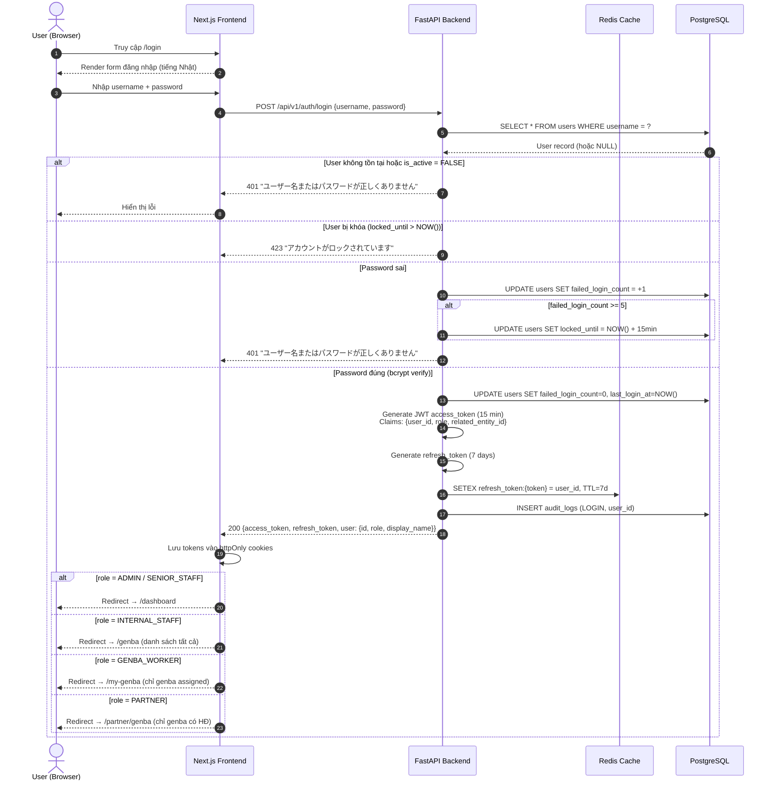
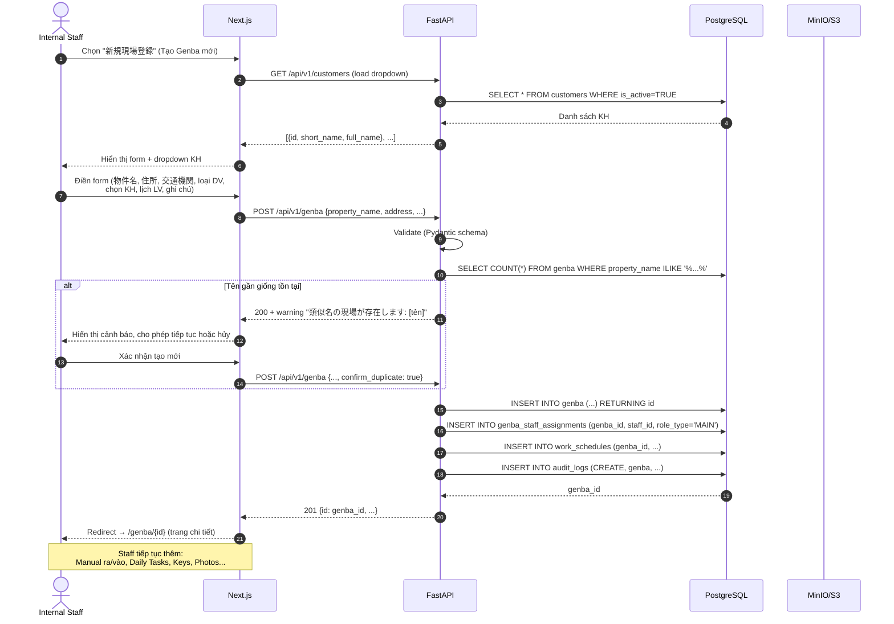
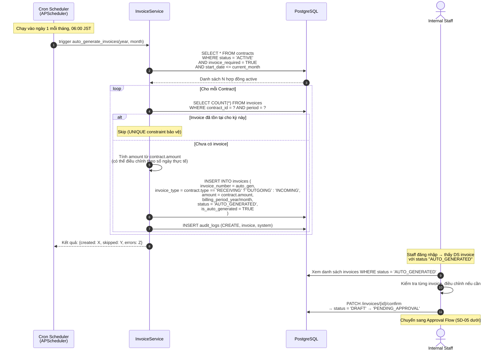
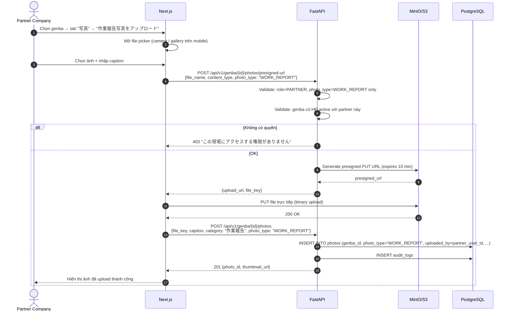
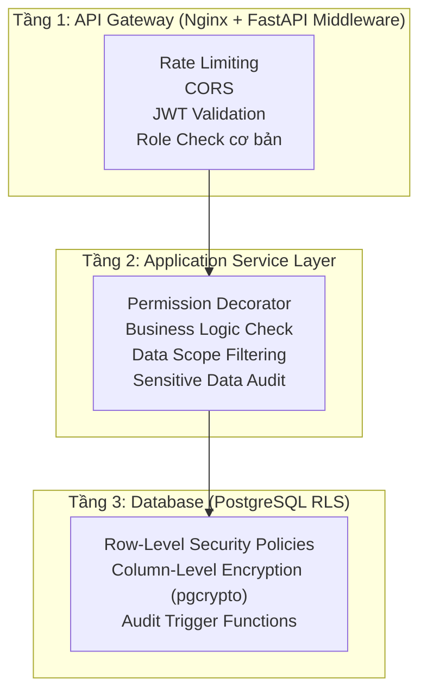
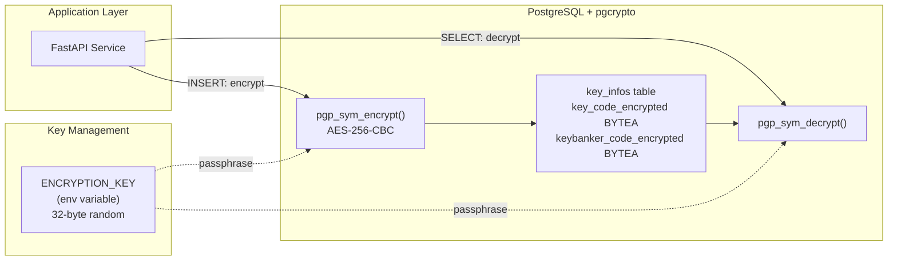
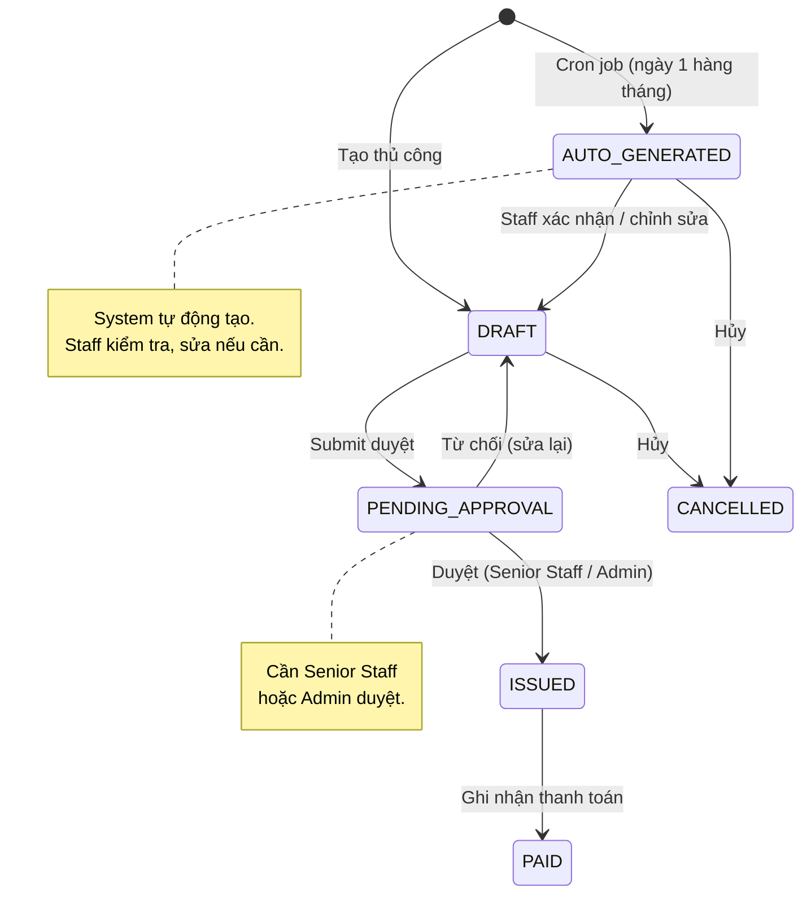
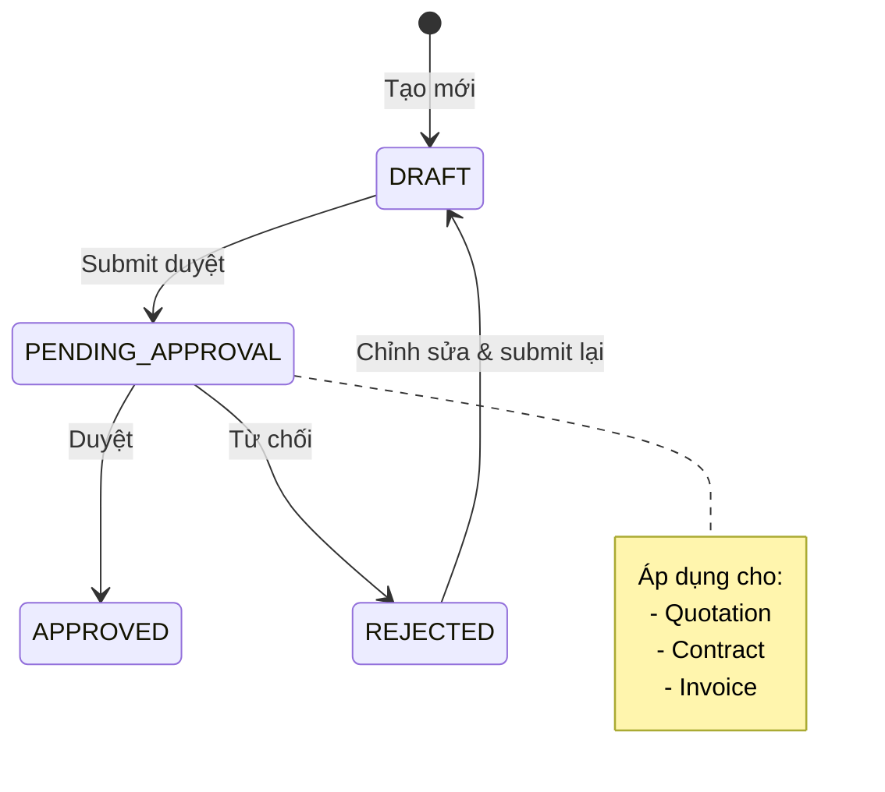
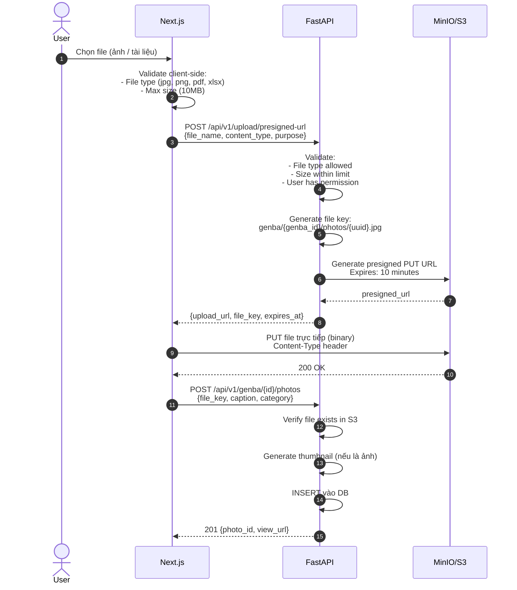

# THIẾT KẾ KIẾN TRÚC & ĐẶC TẢ KỸ THUẬT — Phần 2

**Phiên bản:** 1.0  
**Ngày tạo:** 2026-06-10  
**Trạng thái:** Draft — Chờ review  

---

## MỤC LỤC (Phần 2)

5. [Sequence Diagrams — Luồng xử lý chi tiết](#5-sequence-diagrams)
6. [Thiết kế Bảo mật & Phân quyền (RBAC + RLS)](#6-thiết-kế-bảo-mật--phân-quyền)
7. [Chiến lược Mã hóa Chìa khóa (pgcrypto)](#7-chiến-lược-mã-hóa-chìa-khóa)
8. [Invoice Auto-Generation Engine](#8-invoice-auto-generation-engine)
9. [Approval Workflow Engine](#9-approval-workflow-engine)
10. [File Upload Strategy (MinIO)](#10-file-upload-strategy)
11. [Frontend Architecture](#11-frontend-architecture)

---

## 5. Sequence Diagrams — Luồng xử lý chi tiết

### 5.1. SD-01: Đăng nhập & Phân quyền



### 5.2. SD-02: Tạo Genba mới (Full Flow)



### 5.3. SD-03: Xem chi tiết Genba (phân quyền theo Role)

```mermaid
sequenceDiagram
    autonumber
    actor Actor as User (any role)
    participant Next as Next.js
    participant API as FastAPI
    participant DB as PostgreSQL (RLS)

    Actor->>Next: Chọn genba từ danh sách
    Next->>API: GET /api/v1/genba/{id}<br/>Header: Authorization: Bearer {JWT}
    
    API->>API: Extract JWT → {user_id, role, related_entity_id}
    API->>DB: SET app.user_role = '{role}'<br/>SET app.related_entity_id = '{entity_id}'
    
    Note over DB: RLS Policy tự động lọc:<br/>- PARTNER: chỉ genba có HĐ active<br/>- WORKER: chỉ genba assigned<br/>- STAFF/ADMIN: tất cả
    
    API->>DB: SELECT * FROM genba WHERE id = {id}
    
    alt RLS reject (không có quyền)
        DB-->>API: Empty result
        API-->>Next: 404 "現場が見つかりません"
        Next-->>Actor: Hiển thị "Không tìm thấy"
    else RLS pass
        DB-->>API: Genba data
        
        par Load sub-resources song song
            API->>DB: SELECT * FROM work_schedules WHERE genba_id = ?
            API->>DB: SELECT * FROM entry_exit_instructions WHERE genba_id = ?
            API->>DB: SELECT * FROM photos WHERE genba_id = ?
        end
        
        API->>API: Filter response theo role
        
        alt role = INTERNAL_STAFF / ADMIN
            Note over API: Trả về TẤT CẢ tabs:<br/>基本, 鍵, 入退館, 日常, 定期,<br/>メモ, 写真, 契約, 従業員, 用具, 基準表
        else role = GENBA_WORKER
            Note over API: Trả về: 基本, 鍵(decrypt), 入退館,<br/>日常, 写真, メモ, 勤務, 用具
            API->>DB: SELECT (decrypt key_code) FROM key_infos WHERE genba_id = ?
            API->>DB: INSERT audit_logs (VIEW, key_info, is_sensitive=TRUE)
        else role = PARTNER
            Note over API: Trả về: 基本(không chìa khóa),<br/>入退館, 定期マニュアル, 写真
        end
        
        API-->>Next: 200 {genba: {...}, tabs: [...filtered...]}
        Next-->>Actor: Render trang chi tiết theo tabs được phép
    end
```

### 5.4. SD-04: Tự động tạo Hóa đơn hàng tháng



### 5.5. SD-05: Partner Upload ảnh báo cáo công việc



---

## 6. Thiết kế Bảo mật & Phân quyền (RBAC + RLS)

### 6.1. Kiến trúc phân quyền 3 tầng



### 6.2. Role Definitions & Capabilities

```python
# backend/app/core/permissions.py

from enum import Enum
from typing import Set

class Role(str, Enum):
    ADMIN = "ADMIN"
    SENIOR_STAFF = "SENIOR_STAFF"      # 管理職: Giám đốc, Kế toán
    INTERNAL_STAFF = "INTERNAL_STAFF"  # 社内担当者: 久保, 山中...
    GENBA_WORKER = "GENBA_WORKER"      # 現場員
    CUSTOMER = "CUSTOMER"              # 取引先 (Future - xây sẵn)
    PARTNER = "PARTNER"                # 協力会社

class Permission(str, Enum):
    # Genba
    GENBA_VIEW_ALL = "genba:view:all"
    GENBA_VIEW_ASSIGNED = "genba:view:assigned"
    GENBA_VIEW_CONTRACTED = "genba:view:contracted"
    GENBA_CREATE = "genba:create"
    GENBA_UPDATE = "genba:update"
    GENBA_TERMINATE = "genba:terminate"
    
    # Financial
    FINANCE_VIEW = "finance:view"
    FINANCE_CREATE = "finance:create"
    FINANCE_APPROVE = "finance:approve"
    
    # Key (sensitive)
    KEY_VIEW = "key:view"
    KEY_MANAGE = "key:manage"
    
    # Manual
    MANUAL_VIEW = "manual:view"
    MANUAL_MANAGE = "manual:manage"
    
    # Photo
    PHOTO_VIEW = "photo:view"
    PHOTO_UPLOAD = "photo:upload"
    PHOTO_UPLOAD_WORK_REPORT = "photo:upload:work_report"
    PHOTO_DELETE = "photo:delete"
    
    # User Management
    USER_MANAGE = "user:manage"
    
    # Approval
    APPROVAL_MANAGE = "approval:manage"

# Permission mapping per role
ROLE_PERMISSIONS: dict[Role, Set[Permission]] = {
    Role.ADMIN: set(Permission),  # Tất cả quyền
    
    Role.SENIOR_STAFF: {
        Permission.GENBA_VIEW_ALL,
        Permission.FINANCE_VIEW,
        Permission.FINANCE_APPROVE,
        Permission.APPROVAL_MANAGE,
        Permission.KEY_VIEW,
        Permission.MANUAL_VIEW,
        Permission.PHOTO_VIEW,
    },
    
    Role.INTERNAL_STAFF: {
        Permission.GENBA_VIEW_ALL,
        Permission.GENBA_CREATE,
        Permission.GENBA_UPDATE,
        Permission.GENBA_TERMINATE,
        Permission.FINANCE_VIEW,
        Permission.FINANCE_CREATE,
        Permission.KEY_VIEW,
        Permission.KEY_MANAGE,
        Permission.MANUAL_VIEW,
        Permission.MANUAL_MANAGE,
        Permission.PHOTO_VIEW,
        Permission.PHOTO_UPLOAD,
        Permission.PHOTO_DELETE,
    },
    
    Role.GENBA_WORKER: {
        Permission.GENBA_VIEW_ASSIGNED,
        Permission.KEY_VIEW,           # Chỉ genba assigned
        Permission.MANUAL_VIEW,        # Chỉ genba assigned
        Permission.PHOTO_VIEW,
    },
    
    Role.CUSTOMER: {                   # Future - xây sẵn
        Permission.GENBA_VIEW_CONTRACTED,
    },
    
    Role.PARTNER: {
        Permission.GENBA_VIEW_CONTRACTED,
        Permission.MANUAL_VIEW,        # Chỉ 入退館 + 定期 + 写真
        Permission.PHOTO_VIEW,
        Permission.PHOTO_UPLOAD_WORK_REPORT,
    },
}
```

### 6.3. FastAPI Permission Decorator

```python
# backend/app/core/dependencies.py

from fastapi import Depends, HTTPException, status
from functools import wraps

async def get_current_user(token: str = Depends(oauth2_scheme)) -> User:
    """Decode JWT, validate, return User object."""
    payload = jwt.decode(token, SECRET_KEY, algorithms=["HS256"])
    user = await user_repo.get_by_id(payload["user_id"])
    if not user or not user.is_active:
        raise HTTPException(status_code=401, detail="無効なトークンです")
    return user

def require_permissions(*permissions: Permission):
    """Decorator to check permissions at API level."""
    def decorator(func):
        @wraps(func)
        async def wrapper(*args, current_user: User = Depends(get_current_user), **kwargs):
            user_perms = ROLE_PERMISSIONS.get(current_user.role, set())
            missing = set(permissions) - user_perms
            if missing:
                raise HTTPException(
                    status_code=403, 
                    detail="この操作を行う権限がありません"
                )
            return await func(*args, current_user=current_user, **kwargs)
        return wrapper
    return decorator

# Usage in router:
@router.post("/genba")
@require_permissions(Permission.GENBA_CREATE)
async def create_genba(data: GenbaCreate, current_user: User = Depends(get_current_user)):
    return await genba_service.create(data, current_user)
```

### 6.4. Database RLS — Policies đầy đủ

```sql
-- =============================================
-- RLS SETUP — Thực thi phân quyền ở tầng DB
-- =============================================

-- Hàm helper: lấy role hiện tại từ session variable
CREATE OR REPLACE FUNCTION current_user_role() RETURNS TEXT AS $$
    SELECT current_setting('app.user_role', TRUE);
$$ LANGUAGE SQL STABLE;

CREATE OR REPLACE FUNCTION current_entity_id() RETURNS UUID AS $$
    SELECT current_setting('app.related_entity_id', TRUE)::UUID;
$$ LANGUAGE SQL STABLE;

-- =============================================
-- GENBA RLS
-- =============================================
ALTER TABLE genba ENABLE ROW LEVEL SECURITY;
ALTER TABLE genba FORCE ROW LEVEL SECURITY;

-- Admin, Senior Staff, Internal Staff: xem tất cả
CREATE POLICY staff_genba_policy ON genba
    FOR ALL
    USING (current_user_role() IN ('ADMIN', 'SENIOR_STAFF', 'INTERNAL_STAFF'));

-- Partner: chỉ xem genba có HĐ giao active
CREATE POLICY partner_genba_policy ON genba
    FOR SELECT
    USING (
        current_user_role() = 'PARTNER'
        AND id IN (
            SELECT c.genba_id FROM contracts c
            WHERE c.partner_id = current_entity_id()
              AND c.contract_type = 'ORDERING'
              AND c.status = 'ACTIVE'
        )
    );

-- Worker: chỉ xem genba được assign
CREATE POLICY worker_genba_policy ON genba
    FOR SELECT
    USING (
        current_user_role() = 'GENBA_WORKER'
        AND id IN (
            SELECT gw.genba_id FROM genba_workers gw
            WHERE gw.worker_id = current_entity_id()
              AND gw.is_active = TRUE
        )
    );

-- =============================================
-- CONTRACTS RLS — Partner chỉ thấy HĐ giao cho mình
-- =============================================
ALTER TABLE contracts ENABLE ROW LEVEL SECURITY;
ALTER TABLE contracts FORCE ROW LEVEL SECURITY;

CREATE POLICY staff_contracts ON contracts
    FOR ALL
    USING (current_user_role() IN ('ADMIN', 'SENIOR_STAFF', 'INTERNAL_STAFF'));

CREATE POLICY partner_contracts ON contracts
    FOR SELECT
    USING (
        current_user_role() = 'PARTNER'
        AND contract_type = 'ORDERING'
        AND partner_id = current_entity_id()
    );

-- =============================================
-- KEY_INFOS RLS — Chỉ Staff & Worker (không Partner, không Customer)
-- =============================================
ALTER TABLE key_infos ENABLE ROW LEVEL SECURITY;
ALTER TABLE key_infos FORCE ROW LEVEL SECURITY;

CREATE POLICY staff_keys ON key_infos
    FOR ALL
    USING (current_user_role() IN ('ADMIN', 'INTERNAL_STAFF'));

CREATE POLICY worker_keys ON key_infos
    FOR SELECT
    USING (
        current_user_role() = 'GENBA_WORKER'
        AND genba_id IN (
            SELECT gw.genba_id FROM genba_workers gw
            WHERE gw.worker_id = current_entity_id()
              AND gw.is_active = TRUE
        )
    );
-- Partner & Customer: KHÔNG có policy → không thể truy cập

-- =============================================
-- PHOTOS RLS — Partner xem được (C-22), upload work_report (C-21)
-- =============================================
ALTER TABLE photos ENABLE ROW LEVEL SECURITY;
ALTER TABLE photos FORCE ROW LEVEL SECURITY;

CREATE POLICY staff_photos ON photos
    FOR ALL
    USING (current_user_role() IN ('ADMIN', 'SENIOR_STAFF', 'INTERNAL_STAFF'));

CREATE POLICY worker_photos ON photos
    FOR SELECT
    USING (
        current_user_role() = 'GENBA_WORKER'
        AND genba_id IN (
            SELECT gw.genba_id FROM genba_workers gw
            WHERE gw.worker_id = current_entity_id() AND gw.is_active = TRUE
        )
    );

CREATE POLICY partner_view_photos ON photos
    FOR SELECT
    USING (
        current_user_role() = 'PARTNER'
        AND genba_id IN (
            SELECT c.genba_id FROM contracts c
            WHERE c.partner_id = current_entity_id()
              AND c.contract_type = 'ORDERING' AND c.status = 'ACTIVE'
        )
    );

CREATE POLICY partner_insert_photos ON photos
    FOR INSERT
    WITH CHECK (
        current_user_role() = 'PARTNER'
        AND photo_type = 'WORK_REPORT'
        AND genba_id IN (
            SELECT c.genba_id FROM contracts c
            WHERE c.partner_id = current_entity_id()
              AND c.contract_type = 'ORDERING' AND c.status = 'ACTIVE'
        )
    );
```

### 6.5. Middleware — Set RLS context per request

```python
# backend/app/core/database.py

from contextlib import asynccontextmanager
from sqlalchemy.ext.asyncio import AsyncSession

@asynccontextmanager
async def get_db_session_with_rls(user: User):
    """
    Tạo DB session với RLS context dựa trên user hiện tại.
    Mỗi request sẽ SET session variables để PostgreSQL RLS sử dụng.
    """
    async with async_session_factory() as session:
        # Set RLS context variables
        await session.execute(
            text(f"SET LOCAL app.user_role = '{user.role}'")
        )
        
        # Xác định entity ID theo role
        entity_id = None
        if user.role == Role.PARTNER:
            entity_id = str(user.related_partner_id)
        elif user.role == Role.GENBA_WORKER:
            entity_id = str(user.related_worker_id)
        elif user.role == Role.CUSTOMER:
            entity_id = str(user.related_customer_id)
        elif user.role in (Role.INTERNAL_STAFF, Role.SENIOR_STAFF):
            entity_id = str(user.related_staff_id)
            
        if entity_id:
            await session.execute(
                text(f"SET LOCAL app.related_entity_id = '{entity_id}'")
            )
        
        try:
            yield session
            await session.commit()
        except Exception:
            await session.rollback()
            raise
```

---

## 7. Chiến lược Mã hóa Chìa khóa (pgcrypto)

### 7.1. Thiết kế mã hóa



### 7.2. Implementation

```sql
-- Cài extension
CREATE EXTENSION IF NOT EXISTS pgcrypto;

-- =============================================
-- Hàm encrypt/decrypt với passphrase từ env
-- =============================================

-- Encrypt
CREATE OR REPLACE FUNCTION encrypt_sensitive(plaintext TEXT)
RETURNS BYTEA AS $$
BEGIN
    IF plaintext IS NULL OR plaintext = '' THEN
        RETURN NULL;
    END IF;
    RETURN pgp_sym_encrypt(
        plaintext, 
        current_setting('app.encryption_key'),
        'cipher-algo=aes256'
    );
END;
$$ LANGUAGE plpgsql SECURITY DEFINER;

-- Decrypt
CREATE OR REPLACE FUNCTION decrypt_sensitive(encrypted BYTEA)
RETURNS TEXT AS $$
BEGIN
    IF encrypted IS NULL THEN
        RETURN NULL;
    END IF;
    RETURN pgp_sym_decrypt(
        encrypted, 
        current_setting('app.encryption_key')
    );
EXCEPTION WHEN OTHERS THEN
    RETURN '***DECRYPTION_ERROR***';
END;
$$ LANGUAGE plpgsql SECURITY DEFINER;
```

```python
# backend/app/modules/key_management/service.py

class KeyManagementService:
    
    async def create_key(self, genba_id: UUID, data: KeyCreate, user: User) -> KeyInfo:
        """Tạo key mới — encrypt sensitive fields trước khi lưu."""
        
        async with get_db_session_with_rls(user) as session:
            # Set encryption key từ env
            await session.execute(
                text(f"SET LOCAL app.encryption_key = '{settings.ENCRYPTION_KEY}'")
            )
            
            result = await session.execute(
                text("""
                    INSERT INTO key_infos 
                        (genba_id, key_number, key_type, 
                         key_code_encrypted, usage_location, storage_location,
                         keybanker_code_encrypted, keybanker_location, keybanker_instructions)
                    VALUES 
                        (:genba_id, :key_number, :key_type,
                         encrypt_sensitive(:key_code), :usage_location, :storage_location,
                         encrypt_sensitive(:keybanker_code), :keybanker_location, :keybanker_instructions)
                    RETURNING id
                """),
                {
                    "genba_id": genba_id,
                    "key_number": data.key_number,
                    "key_type": data.key_type,
                    "key_code": data.key_code,         # Plaintext input
                    "usage_location": data.usage_location,
                    "storage_location": data.storage_location,
                    "keybanker_code": data.keybanker_code,  # Plaintext input
                    "keybanker_location": data.keybanker_location,
                    "keybanker_instructions": data.keybanker_instructions,
                }
            )
            
            # Audit log — ghi nhận nhưng KHÔNG log giá trị plaintext
            await self.audit_service.log(
                user_id=user.id,
                action="CREATE",
                entity_type="key_info",
                entity_id=result.scalar(),
                is_sensitive=True,
                new_value={"key_number": data.key_number, "key_type": data.key_type}
                # KHÔNG ghi key_code, keybanker_code vào audit
            )
    
    async def get_keys(self, genba_id: UUID, user: User) -> list[KeyInfoResponse]:
        """Đọc keys — decrypt on-the-fly, ghi audit log."""
        
        async with get_db_session_with_rls(user) as session:
            await session.execute(
                text(f"SET LOCAL app.encryption_key = '{settings.ENCRYPTION_KEY}'")
            )
            
            result = await session.execute(
                text("""
                    SELECT id, key_number, key_type,
                           decrypt_sensitive(key_code_encrypted) as key_code,
                           usage_location, storage_location,
                           decrypt_sensitive(keybanker_code_encrypted) as keybanker_code,
                           keybanker_location, keybanker_instructions,
                           status
                    FROM key_infos
                    WHERE genba_id = :genba_id AND status = 'ACTIVE'
                    ORDER BY key_number
                """),
                {"genba_id": genba_id}
            )
            
            # Audit: ghi nhận AI xem key
            await self.audit_service.log(
                user_id=user.id,
                action="VIEW",
                entity_type="key_info",
                entity_id=genba_id,  # Genba level
                is_sensitive=True
            )
            
            return [KeyInfoResponse(**row._mapping) for row in result]
```

---

## 8. Invoice Auto-Generation Engine

### 8.1. Kiến trúc

```python
# backend/app/modules/invoice/auto_generator.py

from apscheduler.schedulers.asyncio import AsyncIOScheduler
from datetime import date

class InvoiceAutoGenerator:
    """
    Service tự động tạo hóa đơn hàng tháng dựa trên hợp đồng active.
    Chạy bằng APScheduler (cron) vào ngày 1 mỗi tháng, 06:00 JST.
    """
    
    def __init__(self, contract_repo, invoice_repo, audit_service):
        self.contract_repo = contract_repo
        self.invoice_repo = invoice_repo
        self.audit_service = audit_service
    
    async def generate_monthly_invoices(
        self, 
        year: int, 
        month: int
    ) -> dict:
        """
        Main entry point. Tạo invoices cho tất cả contracts active.
        
        Logic:
        1. Query tất cả contracts WHERE status='ACTIVE' AND invoice_required=TRUE
        2. Với mỗi contract:
           - Check đã có invoice cho kỳ này chưa (UNIQUE constraint)
           - Nếu chưa → tạo invoice với status='AUTO_GENERATED'
           - invoice_type: RECEIVING contract → OUTGOING invoice
                          ORDERING contract → INCOMING invoice
        3. Return summary {created, skipped, errors}
        """
        
        contracts = await self.contract_repo.get_active_invoiceable(year, month)
        
        results = {"created": 0, "skipped": 0, "errors": []}
        
        for contract in contracts:
            try:
                # Check trùng
                existing = await self.invoice_repo.find_by_period(
                    contract_id=contract.id,
                    year=year, month=month
                )
                if existing:
                    results["skipped"] += 1
                    continue
                
                # Xác định loại hóa đơn
                invoice_type = (
                    "OUTGOING" if contract.contract_type == "RECEIVING" 
                    else "INCOMING"
                )
                
                # Auto-generate invoice number
                invoice_number = self._generate_invoice_number(
                    invoice_type, year, month
                )
                
                invoice = await self.invoice_repo.create({
                    "invoice_number": invoice_number,
                    "invoice_type": invoice_type,
                    "issue_date": date(year, month, 1),
                    "billing_period_year": year,
                    "billing_period_month": month,
                    "amount": contract.amount,
                    "tax_amount": contract.amount * Decimal("0.10"),  # 10% thuế
                    "status": "AUTO_GENERATED",
                    "is_auto_generated": True,
                    "contract_id": contract.id,
                })
                
                await self.audit_service.log(
                    user_id=None,  # System
                    action="CREATE",
                    entity_type="invoice",
                    entity_id=invoice.id,
                    new_value={"auto_generated": True, "contract_id": str(contract.id)}
                )
                
                results["created"] += 1
                
            except Exception as e:
                results["errors"].append({
                    "contract_id": str(contract.id),
                    "error": str(e)
                })
        
        return results
    
    def _generate_invoice_number(self, inv_type: str, year: int, month: int) -> str:
        """Format: INV-OUT-202604-001 hoặc INV-IN-202604-001"""
        prefix = "INV-OUT" if inv_type == "OUTGOING" else "INV-IN"
        return f"{prefix}-{year}{month:02d}-{self._next_seq()}"

# =============================================
# Scheduler registration (main.py)
# =============================================
# from apscheduler.schedulers.asyncio import AsyncIOScheduler
# from apscheduler.triggers.cron import CronTrigger
#
# scheduler = AsyncIOScheduler(timezone="Asia/Tokyo")
# scheduler.add_job(
#     invoice_auto_generator.generate_monthly_invoices,
#     trigger=CronTrigger(day=1, hour=6, minute=0, timezone="Asia/Tokyo"),
#     args=[datetime.now().year, datetime.now().month],
#     id="monthly_invoice_generation",
#     replace_existing=True
# )
# scheduler.start()
```

### 8.2. State Machine — Invoice Lifecycle



---

## 9. Approval Workflow Engine

### 9.1. State Machine tổng quát



### 9.2. Implementation

```python
# backend/app/core/approval.py

from enum import Enum

class ApprovalStatus(str, Enum):
    PENDING = "PENDING"
    APPROVED = "APPROVED"
    REJECTED = "REJECTED"

class ApprovalService:
    """
    Approval Workflow Engine.
    Áp dụng chung cho Quotation, Contract, Invoice.
    """
    
    APPROVABLE_ENTITIES = {"quotation", "contract", "invoice"}
    
    # Role có quyền duyệt
    APPROVER_ROLES = {Role.ADMIN, Role.SENIOR_STAFF}
    
    async def submit_for_approval(
        self, entity_type: str, entity_id: UUID, user: User
    ) -> ApprovalRequest:
        """Staff submit entity để duyệt."""
        
        if entity_type not in self.APPROVABLE_ENTITIES:
            raise ValueError(f"Entity type '{entity_type}' không hỗ trợ approval")
        
        # Cập nhật trạng thái entity → PENDING_APPROVAL
        await self._update_entity_status(entity_type, entity_id, "PENDING_APPROVAL")
        
        # Tạo approval request
        request = await self.approval_repo.create({
            "entity_type": entity_type,
            "entity_id": entity_id,
            "requested_by": user.id,
            "status": ApprovalStatus.PENDING,
        })
        
        return request
    
    async def approve(
        self, approval_id: UUID, user: User, comment: str = None
    ) -> ApprovalRequest:
        """Senior Staff / Admin duyệt."""
        
        if user.role not in self.APPROVER_ROLES:
            raise PermissionError("この操作を行う権限がありません")
        
        request = await self.approval_repo.get(approval_id)
        if request.status != ApprovalStatus.PENDING:
            raise ValueError("この承認リクエストはすでに処理済みです")
        
        # Cập nhật approval
        request.status = ApprovalStatus.APPROVED
        request.approved_by = user.id
        request.approved_at = datetime.now()
        request.comment = comment
        await self.approval_repo.update(request)
        
        # Cập nhật entity status
        next_status = self._get_approved_status(request.entity_type)
        await self._update_entity_status(
            request.entity_type, request.entity_id, next_status
        )
        
        return request
    
    async def reject(
        self, approval_id: UUID, user: User, comment: str
    ) -> ApprovalRequest:
        """Từ chối — bắt buộc nhập lý do."""
        
        if not comment:
            raise ValueError("却下理由を入力してください")
        
        request = await self.approval_repo.get(approval_id)
        request.status = ApprovalStatus.REJECTED
        request.approved_by = user.id
        request.approved_at = datetime.now()
        request.comment = comment
        await self.approval_repo.update(request)
        
        # Entity quay về DRAFT
        await self._update_entity_status(
            request.entity_type, request.entity_id, "DRAFT"
        )
        
        return request
    
    def _get_approved_status(self, entity_type: str) -> str:
        """Status sau khi được duyệt."""
        return {
            "quotation": "SENT",       # Báo giá → Đã gửi
            "contract": "ACTIVE",      # Hợp đồng → Hiệu lực
            "invoice": "ISSUED",       # Hóa đơn → Đã phát hành
        }[entity_type]
```

---

## 10. File Upload Strategy (MinIO)

### 10.1. Flow — Presigned URL Pattern



### 10.2. MinIO Bucket Structure

```
genba-management/
├── genba/
│   ├── {genba_id}/
│   │   ├── photos/
│   │   │   ├── site/          # Ảnh hiện trường (Staff upload)
│   │   │   ├── work_report/   # Ảnh báo cáo (Partner upload)
│   │   │   └── thumbnails/    # Auto-generated thumbnails
│   │   ├── documents/         # Tài liệu đính kèm
│   │   └── memos/             # Ảnh/file đính kèm trong memo
├── quotations/
│   └── {quotation_id}/        # File đính kèm báo giá
├── invoices/
│   └── {invoice_id}/          # File hóa đơn gốc (INCOMING)
```

### 10.3. Configuration

```python
# backend/app/core/storage.py

from minio import Minio
from datetime import timedelta

class StorageService:
    BUCKET = "genba-management"
    MAX_FILE_SIZE = 10 * 1024 * 1024  # 10MB
    ALLOWED_IMAGE_TYPES = {"image/jpeg", "image/png", "image/webp"}
    ALLOWED_DOC_TYPES = {"application/pdf", "application/vnd.openxmlformats-officedocument.spreadsheetml.sheet"}
    
    def __init__(self):
        self.client = Minio(
            endpoint=settings.MINIO_ENDPOINT,
            access_key=settings.MINIO_ACCESS_KEY,
            secret_key=settings.MINIO_SECRET_KEY,
            secure=settings.MINIO_SECURE,
        )
    
    def generate_presigned_upload_url(
        self, file_key: str, content_type: str
    ) -> str:
        return self.client.presigned_put_object(
            self.BUCKET, 
            file_key, 
            expires=timedelta(minutes=10)
        )
    
    def generate_presigned_view_url(self, file_key: str) -> str:
        return self.client.presigned_get_object(
            self.BUCKET, 
            file_key, 
            expires=timedelta(hours=1)
        )
```

---

## 11. Frontend Architecture (Next.js App Router)

### 11.1. Route Structure

```
frontend/
├── app/
│   ├── (auth)/                     # Auth layout (không sidebar)
│   │   ├── login/page.tsx
│   │   └── layout.tsx
│   │
│   ├── (dashboard)/                # Main layout (có sidebar)
│   │   ├── layout.tsx              # Sidebar + Header + RoleGuard
│   │   │
│   │   ├── genba/
│   │   │   ├── page.tsx            # 現場一覧 (danh sách)
│   │   │   ├── new/page.tsx        # 新規登録
│   │   │   └── [id]/
│   │   │       ├── page.tsx        # 現場詳細 (redirect to first tab)
│   │   │       ├── basic/page.tsx  # 基本情報
│   │   │       ├── keys/page.tsx   # 鍵管理
│   │   │       ├── entry-exit/page.tsx  # 入退館
│   │   │       ├── daily/page.tsx  # 日常マニュアル
│   │   │       ├── periodic/page.tsx    # 定期マニュアル
│   │   │       ├── memos/page.tsx  # その他メモ
│   │   │       ├── photos/page.tsx # 現場写真
│   │   │       ├── contracts/page.tsx   # 契約一覧
│   │   │       ├── workers/page.tsx     # 従業員
│   │   │       ├── equipment/page.tsx   # 清掃用具
│   │   │       ├── standards/page.tsx   # 作業基準表
│   │   │       ├── schedules/page.tsx   # 勤務スケジュール
│   │   │       └── layout.tsx      # Tab navigation layout
│   │   │
│   │   ├── customers/
│   │   │   ├── page.tsx            # 取引先一覧
│   │   │   ├── new/page.tsx
│   │   │   └── [id]/page.tsx       # 取引先詳細
│   │   │
│   │   ├── partners/
│   │   │   ├── page.tsx            # 協力会社一覧
│   │   │   └── [id]/page.tsx
│   │   │
│   │   ├── contracts/
│   │   │   ├── page.tsx            # 契約一覧 (全体)
│   │   │   └── [id]/page.tsx
│   │   │
│   │   ├── quotations/
│   │   │   ├── page.tsx
│   │   │   ├── new/page.tsx
│   │   │   └── [id]/page.tsx
│   │   │
│   │   ├── invoices/
│   │   │   ├── page.tsx            # 請求書一覧
│   │   │   └── [id]/page.tsx
│   │   │
│   │   ├── approvals/
│   │   │   └── page.tsx            # 承認待ち一覧
│   │   │
│   │   ├── staff/
│   │   │   └── page.tsx
│   │   │
│   │   └── settings/               # Admin only
│   │       ├── users/page.tsx
│   │       └── page.tsx
│   │
│   ├── partner/                    # Partner-specific layout
│   │   ├── layout.tsx              # Simplified sidebar
│   │   └── genba/
│   │       ├── page.tsx            # DS genba (scoped)
│   │       └── [id]/page.tsx       # Chi tiết (limited tabs)
│   │
│   ├── my-genba/                   # Worker-specific
│   │   ├── layout.tsx
│   │   ├── page.tsx                # DS genba (assigned)
│   │   └── [id]/page.tsx           # Manual view (mobile-optimized)
│   │
│   ├── globals.css
│   └── layout.tsx                  # Root layout (providers, fonts)
│
├── components/
│   ├── ui/                         # shadcn/ui components
│   ├── layout/
│   │   ├── Sidebar.tsx
│   │   ├── Header.tsx
│   │   └── RoleGuard.tsx           # Route protection by role
│   ├── genba/
│   │   ├── GenbaForm.tsx
│   │   ├── GenbaTable.tsx
│   │   └── GenbaDetailTabs.tsx
│   ├── common/
│   │   ├── DataTable.tsx           # Reusable table with sort/filter/pagination
│   │   ├── FileUpload.tsx          # Presigned URL upload component
│   │   ├── RichTextEditor.tsx      # For manual content
│   │   └── ApprovalBadge.tsx
│   └── forms/
│       ├── CustomerForm.tsx
│       ├── ContractForm.tsx
│       └── InvoiceForm.tsx
│
├── lib/
│   ├── api.ts                      # Axios/fetch wrapper
│   ├── auth.ts                     # Token management
│   └── utils.ts
│
├── hooks/
│   ├── useGenba.ts                 # TanStack Query hooks
│   ├── useContracts.ts
│   └── useAuth.ts
│
└── i18n/
    └── ja.json                     # 日本語 translations (duy nhất)
```

### 11.2. Tab Layout cho Genba Detail

```tsx
// app/(dashboard)/genba/[id]/layout.tsx

import { TabNavigation } from "@/components/layout/TabNavigation";

// Tab hiển thị tuỳ theo role
const TABS_BY_ROLE = {
  ADMIN: [
    { key: "basic",     label: "基本情報",     href: "basic" },
    { key: "keys",      label: "鍵管理",       href: "keys" },
    { key: "entry-exit",label: "入退館",       href: "entry-exit" },
    { key: "daily",     label: "日常マニュアル", href: "daily" },
    { key: "periodic",  label: "定期マニュアル", href: "periodic" },
    { key: "memos",     label: "メモ",         href: "memos" },
    { key: "photos",    label: "写真",         href: "photos" },
    { key: "contracts", label: "契約",         href: "contracts" },
    { key: "workers",   label: "従業員",       href: "workers" },
    { key: "equipment", label: "清掃用具",     href: "equipment" },
    { key: "standards", label: "作業基準表",   href: "standards" },
    { key: "schedules", label: "勤務",         href: "schedules" },
  ],
  INTERNAL_STAFF: "same as ADMIN",
  SENIOR_STAFF: "same as ADMIN",
  GENBA_WORKER: [
    { key: "basic",      label: "基本情報",     href: "basic" },
    { key: "keys",       label: "鍵管理",       href: "keys" },
    { key: "entry-exit", label: "入退館",       href: "entry-exit" },
    { key: "daily",      label: "日常マニュアル", href: "daily" },
    { key: "photos",     label: "写真",         href: "photos" },
    { key: "memos",      label: "メモ",         href: "memos" },
    { key: "equipment",  label: "清掃用具",     href: "equipment" },
    { key: "schedules",  label: "勤務",         href: "schedules" },
  ],
  PARTNER: [
    { key: "basic",      label: "基本情報",     href: "basic" },
    { key: "entry-exit", label: "入退館",       href: "entry-exit" },
    { key: "periodic",   label: "定期マニュアル", href: "periodic" },
    { key: "photos",     label: "写真",         href: "photos" },
  ],
};
```

### 11.3. Mobile-First cho Worker View

```
┌─────────────────────────────┐
│  ≡  現場管理  [ユーザー名]   │  ← Compact header
├─────────────────────────────┤
│  🔍 現場を検索...            │  ← Search bar
├─────────────────────────────┤
│ ┌───────────────────────┐   │
│ │ 📍 BRAVI 新大阪       │   │
│ │    大阪市淀川区宮原... │   │  ← Card layout
│ │    10:00～12:00        │   │
│ └───────────────────────┘   │
│ ┌───────────────────────┐   │
│ │ 📍 岡三証券            │   │
│ │    大阪市阿倍野区...   │   │
│ │    16:00～18:00        │   │
│ └───────────────────────┘   │
├─────────────────────────────┤
│  基本  鍵  入退館  日常  ... │  ← Scrollable tab bar
├─────────────────────────────┤
│                             │
│  【入館方法】               │
│  ■ 玄関 → 呼1513で開錠     │
│  ■ キーバンカー: ****       │  ← Tap to reveal
│  ■ 着替え及び作業準備       │
│                             │
│  【退館方法】               │
│  ■ 鍵をキーバンカーに...    │
│                             │
│  ⚠️ オートロック注意！      │  ← Warning badge
│                             │
└─────────────────────────────┘
```

---

> [!IMPORTANT]
> **Phần 2 của Architecture Design hoàn tất.** Tổng kết toàn bộ tài liệu kiến trúc:
>
> | Phần | Nội dung | Trạng thái |
> |------|----------|------------|
> | 1. Tech Stack | Next.js + FastAPI + PostgreSQL + MinIO + Redis | ✅ |
> | 2. High-Level Architecture | Modular Monolith + Clean Architecture | ✅ |
> | 3. Database Schema | 25+ bảng DDL + ER Diagram + RLS | ✅ |
> | 4. Core API Endpoints | 80+ endpoints RESTful | ✅ |
> | 5. Sequence Diagrams | 5 luồng quan trọng | ✅ |
> | 6. RBAC + RLS | 3-tầng permission, 6 roles, code mẫu | ✅ |
> | 7. Key Encryption | pgcrypto AES-256, encrypt/decrypt functions | ✅ |
> | 8. Invoice Auto-Generation | APScheduler cron, state machine | ✅ |
> | 9. Approval Workflow | State machine chung cho 3 entity types | ✅ |
> | 10. File Upload | MinIO presigned URLs, bucket structure | ✅ |
> | 11. Frontend Architecture | Next.js App Router, role-based tabs, mobile layout | ✅ |
>
> **Bước tiếp theo đề xuất:**
> - Tạo **Implementation Plan** (task breakdown) với timeline ước lượng
> - Thiết kế **CI/CD Pipeline** (Docker → staging → production)
> - Viết **API Contract** chi tiết (Request/Response schema) cho từng endpoint
> - Tạo **Seed Data Script** để import dữ liệu từ Excel hiện tại
