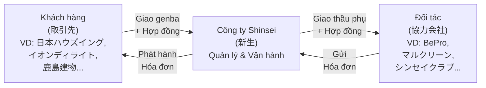
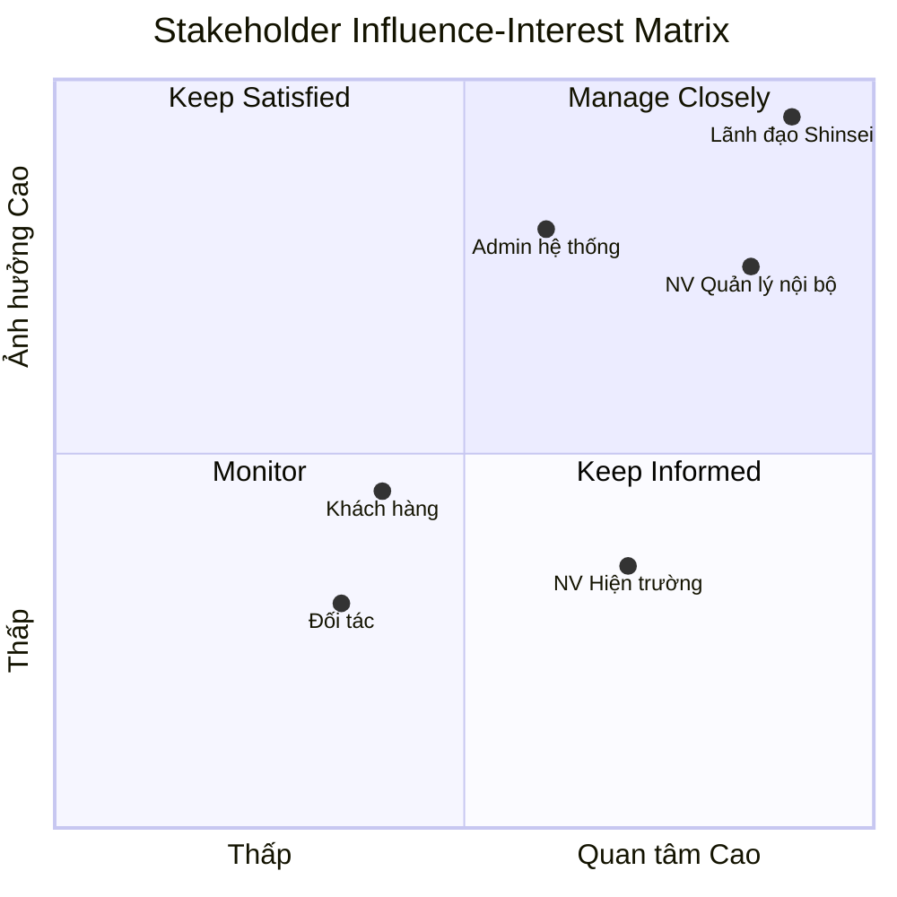
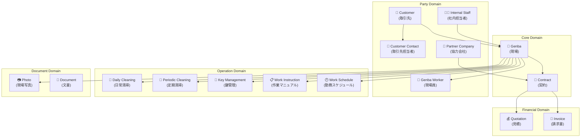
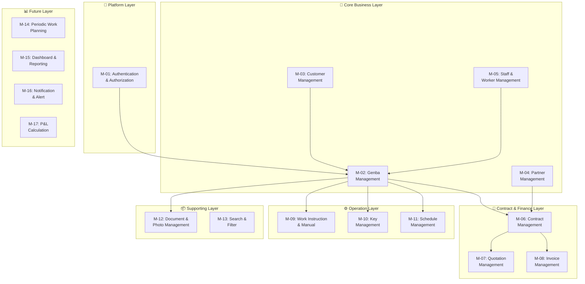

# PHÂN TÍCH NGHIỆP VỤ TOÀN DIỆN - HỆ THỐNG QUẢN LÝ GENBA (現場管理システム)

**Phiên bản:** 1.0  
**Ngày tạo:** 2026-06-09  
**Tác giả:** Business Analyst  
**Trạng thái:** Draft — Chờ review  

---

## MỤC LỤC (Phần 1)

1. [Executive Summary](#1-executive-summary)
2. [Business Problem](#2-business-problem)
3. [Scope Definition](#3-scope-definition)
4. [Stakeholder Analysis](#4-stakeholder-analysis)
5. [Actor List](#5-actor-list)
6. [Domain Model Analysis](#6-domain-model-analysis)
7. [Module Breakdown](#7-module-breakdown)

---

## 1. Executive Summary

### 1.1. Tóm tắt hệ thống

Hệ thống **Quản lý Genba** (Genba Management System — GMS) là một ứng dụng web được thiết kế cho **công ty vệ sinh Shinsei (新生)** nhằm số hóa toàn bộ quy trình quản lý các công trình (現場 — genba) mà công ty đang vận hành dịch vụ vệ sinh.

Hệ thống thay thế hoàn toàn các file Excel hiện tại (Master Data, Manual Excel per genba, danh sách công việc định kỳ, v.v.) bằng một nền tảng tập trung, cho phép quản lý thông tin genba, hợp đồng, báo giá, hóa đơn, nhân viên, đối tác, và tài liệu hướng dẫn vận hành tại mỗi công trình.

### 1.2. Mục tiêu kinh doanh

| # | Mục tiêu | Mô tả |
|---|----------|-------|
| BG-01 | **Tập trung hóa dữ liệu** | Loại bỏ hệ thống Excel phân tán, tạo một nguồn dữ liệu duy nhất (Single Source of Truth) cho ~359 genba hiện tại |
| BG-02 | **Nâng cao hiệu quả vận hành** | Giảm thời gian tra cứu, cập nhật thông tin genba; tự động hóa quy trình thủ công |
| BG-03 | **Kiểm soát nghiệp vụ tài chính** | Quản lý chặt chẽ hợp đồng, báo giá, hóa đơn — cả chiều gửi (cho khách hàng) và chiều nhận (từ đối tác) |
| BG-04 | **Chia sẻ thông tin có kiểm soát** | Cho phép khách hàng và đối tác truy cập thông tin liên quan một cách có phân quyền |
| BG-05 | **Giảm rủi ro mất dữ liệu** | Thay thế file Excel local bằng hệ thống có backup, audit trail |

### 1.3. Giá trị mang lại

- **Cho công ty Shinsei:** Quản lý tập trung ~359 genba, 21 khách hàng, 32 đối tác, với tổng doanh thu hơn ¥57 triệu/tháng; giảm thời gian vận hành, giảm rủi ro sai sót thông tin
- **Cho nhân viên hiện trường:** Truy cập nhanh manual vận hành, thông tin chìa khóa, quy trình ra/vào tòa nhà ngay trên web
- **Cho khách hàng:** Theo dõi tình trạng dịch vụ, hợp đồng liên quan đến genba của mình
- **Cho đối tác:** Chỉ xem được thông tin các genba được phân quyền, liên quan đến phần công việc được giao

### 1.4. Phạm vi MVP

MVP tập trung vào **quản lý thông tin cốt lõi** — chưa bao gồm tự động hóa nâng cao hay tích hợp hệ thống bên ngoài:

1. Quản lý Genba (CRUD + search + manual vận hành)
2. Quản lý Khách hàng & Liên hệ khách hàng
3. Quản lý Nhân viên công ty (phụ trách genba)
4. Quản lý Công ty đối tác
5. Quản lý Hợp đồng (2 chiều: khách hàng & đối tác)
6. Quản lý Báo giá
7. Quản lý Hóa đơn (2 chiều: gửi & nhận)
8. Xác thực & Phân quyền người dùng

### 1.5. Định hướng phát triển tương lai

- Tích hợp quản lý quỹ lương (損益計算 — P&L per genba)
- Kết nối hệ thống chấm công (勤怠アプリ/LINE)
- Quản lý danh sách công việc định kỳ (定期作業一覧表) và công việc đặc biệt (特別作業一覧表)
- Báo cáo hoàn thành công việc (作業完了報告書)
- Dashboard phân tích doanh thu theo nhân viên phụ trách, khách hàng, khu vực
- Mobile-responsive hoặc native app
- Quản lý inspection (清掃インスペクション)

---

## 2. Business Problem

### 2.1. Hiện trạng doanh nghiệp

Công ty Shinsei (新生) là một công ty vệ sinh hoạt động tại khu vực Kansai (Osaka, Kobe, Kyoto), cung cấp dịch vụ:
- **Vệ sinh hằng ngày** (日常清掃): quét, lau, hút bụi, thu gom rác — tại các tòa nhà văn phòng, chung cư
- **Vệ sinh định kỳ** (定期清掃): đánh sàn, wax, làm sạch thảm — theo lịch tháng/quý/năm
- **Quản lý tòa nhà** (管理員): nhân viên quản lý thường trú
- **Dịch vụ chuyên biệt**: tưới cây, quản lý máy nước, dọn cỏ, v.v.

**Quy mô hiện tại (dựa trên dữ liệu thực):**

| Chỉ số | Giá trị |
|--------|---------|
| Tổng số Genba đang quản lý | ~359 |
| Số khách hàng (取引先) | 21 công ty |
| Số đối tác vệ sinh (協力会社) | 32 công ty |
| Số loại dịch vụ | 22 loại |
| Tổng doanh thu tháng (ước tính) | ¥57,478,117 |
| Số nhân viên quản lý nội bộ (担当) | 6 người (久保, 山中, サン, 松崎, 新木, 松本) |

**Mô hình kinh doanh 3 bên:**

### 2.2. Các khó khăn đang gặp phải

#### 2.2.1. Quản lý dữ liệu phân tán bằng Excel

Hiện tại, toàn bộ nghiệp vụ được quản lý trên **hệ thống file Excel phức tạp**:

| Loại file | Mô tả | Vấn đề |
|-----------|--------|--------|
| `◎現場一覧表◎マスターデータ.xlsx` | Bảng master chứa 359 genba với ~30 cột thông tin | File đơn lẻ, nhiều người dùng chung, rủi ro conflict |
| `現場管理マニュアル/[Khách hàng]/[Genba].xlsx` | Mỗi genba 1 file Excel riêng, 6 sheet | Hàng trăm file phân tán trong thư mục lồng nhau |
| `清掃インスペクションシート.xls` | Bảng kiểm tra chất lượng (4.5MB) | File nặng, định dạng cũ (.xls) |
| Báo giá, đơn đặt hàng, lịch trình | Mỗi loại là file riêng | Không liên kết với dữ liệu master |

#### 2.2.2. Quy trình quản lý manual phức tạp

Mỗi genba yêu cầu **1 file Excel riêng** với 6 sheet chi tiết:

1. **基本** (Cơ bản): Tên, địa chỉ, giao thông, lịch làm việc, quản lý chìa khóa (tối đa 5 chìa), ghi chú
2. **入退館他** (Ra/vào): Hướng dẫn chi tiết cách vào/ra tòa nhà (mã cửa, keybanker, v.v.)
3. **日常マニュアル** (Hướng dẫn hằng ngày): Lịch trình từng khung giờ, vị trí, nội dung công việc
4. **定期マニュアル** (Hướng dẫn định kỳ): Lịch 12 tháng, nội dung tác vụ theo vị trí & chất liệu sàn
5. **その他メモ** (Ghi chú khác): Lịch sử sự kiện, chỉ thị, memo tuần tra
6. **現場写真** (Ảnh hiện trường): Ảnh ngoại thất, lối vào, khu vực làm việc

> **Với 359 genba → 359 file Excel × 6 sheet = ~2,154 sheet cần duy trì thủ công**

#### 2.2.3. Không có phân quyền truy cập

- File Excel không kiểm soát được ai xem, ai sửa
- Đối tác và khách hàng không thể truy cập thông tin — phải gửi qua email/fax
- Không có audit trail khi dữ liệu bị thay đổi

#### 2.2.4. Thiếu liên kết giữa các nghiệp vụ

Dựa trên sơ đồ nghiệp vụ hiện tại ([hình ảnh](file:///Users/shinseintt/data/projects/kaisha/genba_kanri/現場管理一覧表◎イメージ2026.4.16.png)):

- Master data → Manual → Định kỳ → Hóa đơn → P&L → Lương được liên kết **thủ công**
- Không có tham chiếu tự động giữa hợp đồng ↔ hóa đơn ↔ genba
- Thông tin nhân viên trên master data có thể không đồng bộ với manual

### 2.3. Các quy trình đang thực hiện thủ công

| # | Quy trình | Phương thức hiện tại | Tần suất |
|---|-----------|---------------------|----------|
| 1 | Tạo/cập nhật thông tin genba | Sửa file Excel master data | Khi có genba mới hoặc thay đổi |
| 2 | Tạo manual vận hành cho genba mới | Copy template Excel, điền 6 sheet | Mỗi genba mới |
| 3 | Tra cứu thông tin genba | Mở file Excel, tìm kiếm thủ công | Hàng ngày |
| 4 | Quản lý chìa khóa | Ghi vào sheet 基本 của mỗi genba | Khi thay đổi |
| 5 | Phát hành hóa đơn | Tạo từ dữ liệu master, tính toán riêng | Hàng tháng |
| 6 | Quản lý lịch vệ sinh định kỳ | File riêng, cập nhật thủ công | Hàng tháng |
| 7 | Gửi lịch & đơn đặt hàng cho đối tác | Tạo file riêng, gửi email/fax | Hàng tháng |
| 8 | Theo dõi hợp đồng (bắt đầu, hết hạn) | Cột trên master data | Khi cần kiểm tra |
| 9 | Phân bổ doanh thu theo nhân viên quản lý | Cột X-AC trên master data | Khi cần báo cáo |

### 2.4. Rủi ro hiện tại

| # | Rủi ro | Mức độ | Mô tả |
|---|--------|--------|-------|
| R-01 | Mất dữ liệu | **Cao** | File Excel local không có backup tự động, 1 file hỏng = mất toàn bộ master data 359 genba |
| R-02 | Dữ liệu không nhất quán | **Cao** | Thông tin trên master data và manual có thể bị lệch do cập nhật thủ công |
| R-03 | Rò rỉ thông tin nhạy cảm | **Trung bình** | Mã cửa, mã keybanker (VD: '3911'), thông tin chìa khóa nằm trong file Excel không mã hóa |
| R-04 | Conflict khi nhiều người sửa | **Trung bình** | File master data chỉ có 1, nhiều nhân viên quản lý cần truy cập đồng thời |
| R-05 | Khó scale | **Trung bình** | Thêm genba mới = thêm 1 file Excel mới, quản lý thư mục phức tạp hơn |

### 2.5. Các cơ hội cải thiện

1. **Tập trung hóa**: Một hệ thống web duy nhất thay thế hàng trăm file Excel
2. **Tự động hóa liên kết**: Hợp đồng ↔ Hóa đơn ↔ Genba được tham chiếu tự động
3. **Phân quyền**: Khách hàng và đối tác tự tra cứu thông tin, giảm tải cho nhân viên nội bộ
4. **Mobile access**: Nhân viên hiện trường tra cứu manual trên điện thoại thay vì in giấy
5. **Cảnh báo tự động**: Hợp đồng sắp hết hạn, genba chưa có manual, thông tin thiếu
6. **Báo cáo & phân tích**: Dashboard doanh thu theo khách hàng, đối tác, nhân viên quản lý

---

## 3. Scope Definition

### 3.1. In Scope (MVP)

| # | Chức năng | Mô tả |
|---|-----------|-------|
| S-01 | **Quản lý Genba** | CRUD thông tin cơ bản genba (tên, địa chỉ, giao thông, lịch làm việc, ghi chú); Upload ảnh hiện trường |
| S-02 | **Quản lý Manual vận hành** | Tạo/sửa hướng dẫn ra/vào tòa nhà, manual vệ sinh hằng ngày, manual vệ sinh định kỳ, memo/ghi chú cho mỗi genba |
| S-03 | **Quản lý Chìa khóa** | CRUD thông tin chìa khóa (hình dạng, mã số, nơi sử dụng, nơi bảo quản) cho mỗi genba |
| S-04 | **Quản lý Khách hàng** | CRUD thông tin khách hàng (取引先) và người liên hệ phía khách hàng (担当者) |
| S-05 | **Quản lý Nhân viên nội bộ** | CRUD thông tin nhân viên công ty Shinsei phụ trách genba |
| S-06 | **Quản lý Nhân viên hiện trường** | CRUD thông tin nhân viên làm việc tại genba (tên, SĐT, email, ngày sinh, ghi chú) |
| S-07 | **Quản lý Công ty đối tác** | CRUD thông tin công ty đối tác (協力会社) |
| S-08 | **Quản lý Hợp đồng** | CRUD hợp đồng khách hàng (nhận genba) và hợp đồng đối tác (giao thầu phụ); Liên kết với genba |
| S-09 | **Quản lý Báo giá** | CRUD báo giá gắn với genba/hợp đồng; Thông tin ngày lập, số tiền, nội dung |
| S-10 | **Quản lý Hóa đơn** | CRUD hóa đơn gửi cho khách hàng và hóa đơn nhận từ đối tác; Liên kết với hợp đồng |
| S-11 | **Xác thực & Phân quyền** | Đăng nhập bằng tài khoản được cấp; Phân quyền theo vai trò (Admin, Staff, Customer, Partner) |
| S-12 | **Tìm kiếm & Lọc** | Tìm kiếm genba, khách hàng, hợp đồng theo nhiều tiêu chí |
| S-13 | **Quản lý Tài liệu & Ảnh** | Upload/xem ảnh hiện trường, file đính kèm cho genba |

### 3.2. Future Scope (Giai đoạn 2)

| # | Chức năng | Lý do hoãn |
|---|-----------|------------|
| F-01 | **Quản lý công việc định kỳ (定期作業一覧表)** | Cần thiết kế lịch trình phức tạp, phụ thuộc vào dữ liệu genba MVP |
| F-02 | **Quản lý công việc đặc biệt/spot (特別作業)** | Nghiệp vụ phụ, ưu tiên thấp hơn |
| F-03 | **Dashboard & Báo cáo** | Cần dữ liệu tích lũy từ MVP để có giá trị |
| F-04 | **P&L per genba (損益計算表)** | Liên quan tài chính phức tạp, cần tích hợp với dữ liệu lương |
| F-05 | **Tích hợp hệ thống chấm công** | Phụ thuộc hệ thống bên ngoài (勤怠アプリ/LINE) |
| F-06 | **Báo cáo hoàn thành công việc (作業完了報告書)** | Nghiệp vụ follow-up, cần quy trình cơ bản trước |
| F-07 | **Quản lý Inspection (インスペクション)** | Quy trình phức tạp, file template 4.5MB |
| F-08 | **Cảnh báo & Notification** | Giá trị gia tăng, không blocking cho MVP |
| F-09 | **Mobile App** | Web responsive trước, native app sau |
| F-10 | **Phát hành đơn đặt hàng cho đối tác** | Tự động hóa nâng cao |

### 3.3. Out of Scope

| # | Chức năng | Lý do |
|---|-----------|-------|
| O-01 | Quản lý nhân sự (HR) / Hợp đồng lao động (雇用契約書) | Thuộc hệ thống HR riêng |
| O-02 | Tính lương / Bảng lương (給与明細) | Thuộc hệ thống kế toán/payroll |
| O-03 | Kế toán tổng hợp | Thuộc hệ thống kế toán riêng |
| O-04 | Quản lý kho / Vật tư vệ sinh | Không có trong yêu cầu |
| O-05 | CRM / Marketing | Không phải mục tiêu của hệ thống |
| O-06 | Quản lý đấu thầu | Không có trong yêu cầu |

---

## 4. Stakeholder Analysis

### 4.1. Stakeholder chính

| # | Stakeholder | Vai trò | Mục tiêu | Quyền hạn | Mức độ ảnh hưởng |
|---|-------------|---------|-----------|------------|------------------|
| SH-01 | **Lãnh đạo công ty Shinsei** | Sponsor / Decision Maker | Số hóa vận hành, kiểm soát doanh thu, giảm chi phí quản lý | Quyết định phạm vi, ngân sách, ưu tiên | **Rất cao** |
| SH-02 | **Nhân viên quản lý nội bộ (担当)** | Primary User (6 người: 久保, 山中, サン, 松崎, 新木, 松本) | Quản lý genba được phân công hiệu quả; tra cứu nhanh; giảm thao tác thủ công | Quản lý toàn bộ genba thuộc phạm vi; tạo/sửa hợp đồng, hóa đơn | **Cao** |
| SH-03 | **Nhân viên hiện trường (現場員)** | End User | Tra cứu nhanh manual vận hành, thông tin chìa khóa, quy trình ra/vào | Chỉ xem thông tin genba được phân công | **Trung bình** |
| SH-04 | **Khách hàng (取引先)** | External User | Theo dõi tình trạng dịch vụ, hợp đồng, genba của mình | Chỉ xem thông tin genba/hợp đồng liên quan | **Trung bình** |
| SH-05 | **Công ty đối tác (協力会社)** | External User | Xem thông tin genba được giao; lịch trình công việc | Chỉ xem genba/hợp đồng được phân quyền | **Trung bình** |
| SH-06 | **Quản trị viên hệ thống** | System Admin | Quản lý user, phân quyền, cấu hình hệ thống | Toàn quyền trên hệ thống | **Cao** |

### 4.2. Ma trận Ảnh hưởng — Quan tâm

---

## 5. Actor List

| Actor ID | Actor Name | Description |
|----------|-----------|-------------|
| ACT-01 | **System Admin** (管理者) | Quản trị viên hệ thống. Quản lý tài khoản, phân quyền, cấu hình master data. Có toàn quyền trên hệ thống. |
| ACT-02 | **Internal Staff** (社内担当者) | Nhân viên quản lý nội bộ công ty Shinsei (VD: 久保, 山中, 松崎...). Phụ trách một nhóm genba, quản lý hợp đồng, báo giá, hóa đơn, tạo manual. |
| ACT-03 | **Genba Worker** (現場員) | Nhân viên thực tế làm việc tại genba (VD: 安彦, 山本, 武田...). Tra cứu manual vận hành, thông tin chìa khóa, lịch làm việc. |
| ACT-04 | **Customer** (取引先) | Công ty khách hàng giao genba cho Shinsei (VD: 日本ハウズイング, イオンディライト, 鹿島建物...). Xem thông tin genba và hợp đồng liên quan. |
| ACT-05 | **Customer Contact** (取引先担当者) | Người liên hệ cụ thể phía khách hàng (VD: 樋口, 高木, 石井...). Tương tác trực tiếp với Shinsei về genba cụ thể. |
| ACT-06 | **Partner Company** (協力会社) | Công ty đối tác nhận thầu phụ từ Shinsei (VD: BePro, マルクリーン, エーワイ...). Chỉ xem genba/hợp đồng được phân quyền. |
| ACT-07 | **System** (システム) | Actor phi nhân (hệ thống tự động). Thực hiện validation, tính toán, cảnh báo. |

> [!NOTE]
> **Phân biệt quan trọng:**
> - **Customer Contact (ACT-05)** là *người liên hệ* tại công ty khách hàng — họ là cá nhân cụ thể (tên, SĐT, email)
> - **Customer (ACT-04)** là *công ty khách hàng* — là pháp nhân (tên công ty, chi nhánh)
> - Một Customer có thể có nhiều Customer Contact
> - Trong SRS gốc, "Nhân viên phụ trách genba phía khách hàng" chính là Customer Contact

---

## 6. Domain Model Analysis

### 6.1. Tổng quan Domain

Dựa trên phân tích dữ liệu thực tế, hệ thống bao gồm **16 Domain chính**:

### 6.2. Chi tiết từng Domain

#### 6.2.1. 🏢 Genba (現場) — Core Domain

**Trách nhiệm:** Đại diện cho một công trình/tòa nhà/địa điểm mà công ty Shinsei cung cấp dịch vụ vệ sinh. Đây là entity trung tâm của toàn bộ hệ thống — mọi nghiệp vụ đều xoay quanh genba.

**Dữ liệu chính (từ master data thực tế):**
- Tên công trình (物件名): VD: "ユニバーサルスタジオジャパン デッキオフィス", "BRAVI 新大阪"
- Địa chỉ (住所): VD: "大阪市淀川区宮原2丁目1"
- Giao thông (交通機関): VD: "地下鉄御堂筋線東三国駅から徒歩5分"
- Loại dịch vụ (内容): 日常清掃, 管理員, 定期清掃, v.v.
- Lịch làm việc: ngày trong tuần, giờ bắt đầu/kết thúc, số giờ/ngày, số lần/tuần
- Quy định nghỉ lễ (休日規定): nghỉ ngày lễ, Obon, Tết
- Trạng thái: Đang hoạt động / Đã kết thúc (終了現場)
- Mức độ ưu tiên (優先順位): A, 代行無, v.v.
- Mã MCD

**Quan hệ:**
- Thuộc về 1 Customer (取引先)
- Được phụ trách bởi 1 Internal Staff (担当)
- Có thể được giao cho 1+ Partner Company
- Có nhiều Contract, Worker, Key, Instruction, Photo

---

#### 6.2.2. 🏬 Customer (取引先) — Party Domain

**Trách nhiệm:** Đại diện cho công ty khách hàng giao genba cho Shinsei. Đây thường là các công ty quản lý tòa nhà (Building Management).

**Dữ liệu chính (21 khách hàng thực tế):**
- Tên rút gọn: イオン, ハウズビル不, ハウズ大阪北, ハウズ大阪南, ハウズ大阪, ハウズ神戸, ハウズ京都, ザイマ関西, ザイマサラ, ケントク, オリックス, エスリード, ランドレック, 鹿島建物, 日昌, オービーケー, v.v.
- Tên đầy đủ (cần bổ sung): VD "ハウズビル不" → 日本ハウズイング株式会社 ビル不動産部

**Quan hệ:**
- Có nhiều Customer Contact
- Giao nhiều Genba cho Shinsei
- Nhận hóa đơn từ Shinsei

---

#### 6.2.3. 👤 Customer Contact (取引先担当者) — Party Domain

**Trách nhiệm:** Người liên hệ cụ thể tại công ty khách hàng, phụ trách theo dõi genba. Mỗi genba trên master data có cột 担当 (phía khách hàng).

**Dữ liệu:** Họ tên (VD: 樋口, 高木, 石井, 町谷, 十代...), SĐT, Email, Ghi chú

---

#### 6.2.4. 🤝 Partner Company (協力会社) — Party Domain

**Trách nhiệm:** Công ty đối tác nhận thầu phụ từ Shinsei để thực hiện công việc tại genba. Đôi khi 1 genba có nhiều đối tác (VD: "BePro/ビルテック", "シンセイ/エーワイ").

**Dữ liệu chính (32 đối tác thực tế):** BePro, マルクリーン, エーワイ, シンセイクラブ, ワークハード, アシストワン, プラスワン, トライアップ, 浦工業, ㈱山本, 八翔, 龍実, ネクストライフ, v.v.

**Đặc điểm nghiệp vụ:**
- Một genba có thể sử dụng nhiều đối tác (cột "定期" trên master data ghi tên đối tác, đôi khi ghi "BePro/ビルテック" nghĩa là 2 đối tác)
- Có genba "無し" (không có đối tác — Shinsei tự làm)
- Đối tác chỉ được xem thông tin genba được phân quyền

---

#### 6.2.5. 👨‍💼 Internal Staff (社内担当者) — Party Domain

**Trách nhiệm:** Nhân viên quản lý nội bộ của Shinsei, mỗi người phụ trách một nhóm genba. Chịu trách nhiệm tạo manual, theo dõi hợp đồng, phát hành hóa đơn.

**Dữ liệu thực tế (6 người):**

| Tên | Doanh thu phụ trách/tháng | Tỷ lệ |
|-----|--------------------------|-------|
| 久保 | ¥21,167,455 | 36.8% |
| 山中 | ¥8,772,452 | 15.3% |
| サン | ¥8,272,398 | 14.4% |
| 松崎 | ¥4,711,844 | 8.2% |
| 新木 | ¥7,477,199 | 13.0% |
| 松本 | ¥7,076,769 | 12.3% |
| **Tổng** | **¥57,478,117** | **100%** |

---

#### 6.2.6. 👷 Genba Worker (現場員) — Party Domain

**Trách nhiệm:** Nhân viên thực tế làm việc tại genba hàng ngày. Cần tra cứu manual vận hành, thông tin chìa khóa.

**Dữ liệu:** Họ tên (VD: 安彦, 山本, 武田, 藤, 鈴木, 富田...), SĐT, Email, Ngày sinh, Ghi chú
- Một số genba ghi "実習生" (thực tập sinh) → cần xác nhận đây là worker hay loại đặc biệt

---

#### 6.2.7. 📄 Contract (契約) — Core Domain

**Trách nhiệm:** Quản lý hợp đồng giữa các bên. Hệ thống có **2 loại hợp đồng**:

1. **Hợp đồng nhận (受注契約):** Shinsei nhận genba từ khách hàng
2. **Hợp đồng giao (発注契約):** Shinsei giao thầu phụ cho đối tác

**Dữ liệu (từ SRS & master data):**
- Mã hợp đồng
- Số tiền (御請求額): VD ¥187,000, ¥150,000, ¥283,000...
- Ngày bắt đầu (契約開始): VD "2025.12.31", "2026.2.6", "2026.3.31"
- Thời hạn hợp đồng
- Đơn giá giờ (時間単価): VD ¥1,458, ¥1,557, ¥1,600...

---

#### 6.2.8. 💰 Quotation (見積) — Financial Domain

**Trách nhiệm:** Quản lý báo giá gửi cho khách hàng trước khi ký hợp đồng.

**Dữ liệu (từ file báo giá thực tế — 岡三証券):**
- Tên công việc: "岡三証券 日常清掃作業費"
- Đơn giá: ¥4,000/ngày
- Chu kỳ: 月曜日～金曜日（祝日は休み）
- Thời gian: 16:00～18:00 (2.0h × 1名)
- Điều kiện đặc biệt: thời hạn giới hạn, vật tư do khách cung cấp
- Tham chiếu: "別紙添付『日常清掃作業基準表』の通り" (theo bảng tiêu chuẩn đính kèm)

---

#### 6.2.9. 🧾 Invoice (請求書) — Financial Domain

**Trách nhiệm:** Quản lý hóa đơn — cả 2 chiều:
1. **Hóa đơn gửi (発行):** Shinsei gửi cho khách hàng
2. **Hóa đơn nhận (受領):** Đối tác gửi cho Shinsei

**Dữ liệu:** Liên kết hợp đồng, ngày lập, số tiền, trạng thái
- Master data có cột "請求書発行有無" (có/không phát hành hóa đơn)

---

#### 6.2.10. 🧹 Daily Cleaning Service (日常清掃) — Operation Domain

**Trách nhiệm:** Chi tiết dịch vụ vệ sinh hàng ngày tại genba.

**Dữ liệu (từ manual thực tế — BRAVI新大阪, 岡三証券):**
- Lịch trình theo khung giờ (VD: 10:00 → 1階 ごみ庫, 11:00 → 各階廊下)
- Vị trí & tên khu vực (VD: エントランス, EV内, 廊下, 階段)
- Nội dung công việc chi tiết (VD: "掃き拭き", "ポストごみ回収", "ガラス清掃")
- Ghi chú đặc biệt (VD: "オートロックなのでインキーに注意！")
- Thời gian bắt đầu/kết thúc, tần suất, số lượng nhân viên

---

#### 6.2.11. 📅 Periodic Cleaning Service (定期清掃) — Operation Domain

**Trách nhiệm:** Quản lý lịch vệ sinh định kỳ theo tháng/quý/năm.

**Dữ liệu (từ manual thực tế):**
- Nhóm tác nghiệp (作業班): VD "自社" (tự làm)
- Nội dung: 床面洗浄 (đánh sàn), ガラス清掃 (kính), カーペット洗浄 (thảm)
- Lịch 12 tháng (4月～3月) — đánh dấu tháng thực hiện
- Manual chi tiết: vị trí, chất liệu sàn (材質), nội dung tác vụ

---

#### 6.2.12. 🔑 Key Management (鍵管理) — Operation Domain

**Trách nhiệm:** Quản lý chìa khóa, thẻ từ, mã cửa tự động mà nhân viên cần để vào/ra genba.

**Dữ liệu (từ manual thực tế):**
- Tối đa 5 key per genba
- Hình dạng: シリンダー (cylinder) / カード (card)
- Mã số chìa khóa: VD "WEST", "OS 113734"
- Nơi sử dụng: VD "エントランス・火災受診室・ゴミ庫", "地下4階・倉庫"
- Nơi bảo quản: 清掃員 (nhân viên) / 会社 (công ty) / 現場 (tại genba)
- Thông tin keybanker: mã số (VD: "3911"), vị trí đặt

> [!WARNING]
> **Dữ liệu nhạy cảm:** Mã cửa, mã keybanker là thông tin bảo mật cao. Hệ thống cần mã hóa và kiểm soát truy cập chặt chẽ cho domain này.

---

#### 6.2.13. 📋 Work Instruction (作業マニュアル) — Operation Domain

**Trách nhiệm:** Hướng dẫn vận hành tổng hợp cho mỗi genba, bao gồm quy trình ra/vào tòa nhà.

**Dữ liệu (từ sheet 入退館他):**
- Hướng dẫn vào (入館方法): từng bước chi tiết (VD: "呼1513で開錠", "ダイヤルを8909に合わし...")
- Hướng dẫn ra (退館方法): từng bước chi tiết
- Lưu ý an toàn (VD: "車の通行が多いので安全に注意")

---

#### 6.2.14. 🕐 Work Schedule (勤務スケジュール) — Operation Domain

**Trách nhiệm:** Lịch làm việc hợp đồng tại mỗi genba.

**Dữ liệu:**
- Ngày làm việc trong tuần (VD: 月～金, 月水金, 火以外)
- Giờ làm việc (VD: 9:00～15:00, 16:00～18:00)
- Số lần/tuần (〇回/週): VD 3, 5, 7
- Số giờ/ngày (〇時間/日): VD 2, 3, 4.75, 6, 8
- Thời gian nghỉ (休憩): phút
- Quy định ngày lễ/Obon/Tết

---

#### 6.2.15. 📷 Photo (現場写真) — Document Domain

**Trách nhiệm:** Ảnh hiện trường phục vụ cho manual vận hành.

**Dữ liệu (từ manual thực tế — BRAVI新大阪):**
- Ảnh phân loại: 外観 (ngoại thất), 玄関 (lối vào), エントランス, 廊下 (hành lang), 階段 (cầu thang), 駐輪場 (bãi xe), ポスト (hộp thư), ごみ庫 (kho rác), 掃除道具置き場 (kho dụng cụ), 駐車場 (bãi đỗ xe)
- Caption/mô tả cho mỗi ảnh

---

#### 6.2.16. 📁 Document (文書) — Document Domain

**Trách nhiệm:** Quản lý tài liệu đính kèm như bảng tiêu chuẩn công việc, biên bản giao nhận chìa khóa, v.v.

**Dữ liệu:** File name, loại tài liệu, ngày tạo, genba liên quan
- VD: 清掃作業基準表, 鍵預かり書, 予定表

---

## 7. Module Breakdown

### 7.1. Tổng quan Module

### 7.2. Chi tiết từng Module

| Module ID | Module Name | Description | Priority | MVP / Future |
|-----------|-------------|-------------|----------|--------------|
| **M-01** | **Authentication & Authorization** | Đăng nhập bằng tài khoản được cấp. Phân quyền theo vai trò: Admin, Internal Staff, Genba Worker, Customer, Partner. Kiểm soát truy cập theo genba/khách hàng/đối tác. | **P0 — Critical** | ✅ MVP |
| **M-02** | **Genba Management** | Quản lý thông tin cơ bản genba: tên, địa chỉ, giao thông, loại dịch vụ, lịch làm việc, quy định nghỉ lễ, trạng thái (đang hoạt động/kết thúc), mức độ ưu tiên, ghi chú đặc biệt. Hỗ trợ genba đã kết thúc (終了現場用の移行ページ). | **P0 — Critical** | ✅ MVP |
| **M-03** | **Customer Management** | Quản lý thông tin công ty khách hàng (取引先): tên công ty, chi nhánh, thông tin liên hệ. Quản lý người liên hệ phía khách hàng (取引先担当者): họ tên, SĐT, email, ghi chú. Liên kết Customer ↔ Genba. | **P0 — Critical** | ✅ MVP |
| **M-04** | **Partner Company Management** | Quản lý thông tin công ty đối tác (協力会社): tên, thông tin liên hệ, danh sách genba được giao. Hỗ trợ trường hợp 1 genba có nhiều đối tác. | **P1 — High** | ✅ MVP |
| **M-05** | **Staff & Worker Management** | Quản lý nhân viên nội bộ (社内担当者) và nhân viên hiện trường (現場員). Phân công nhân viên nội bộ phụ trách genba. Ghi nhận nhân viên hiện trường theo genba. | **P1 — High** | ✅ MVP |
| **M-06** | **Contract Management** | Quản lý 2 loại hợp đồng: (1) Hợp đồng nhận từ khách hàng, (2) Hợp đồng giao cho đối tác. Thông tin: mã HĐ, số tiền, ngày bắt đầu, thời hạn, đơn giá giờ, trạng thái. Liên kết HĐ ↔ Genba ↔ Customer/Partner. | **P0 — Critical** | ✅ MVP |
| **M-07** | **Quotation Management** | Quản lý báo giá: tên công việc, đơn giá, chu kỳ, thời gian, điều kiện, tham chiếu bảng tiêu chuẩn. Liên kết báo giá ↔ Genba ↔ HĐ. | **P1 — High** | ✅ MVP |
| **M-08** | **Invoice Management** | Quản lý hóa đơn 2 chiều: (1) Hóa đơn Shinsei gửi cho khách hàng, (2) Hóa đơn đối tác gửi cho Shinsei. Liên kết hóa đơn ↔ HĐ. Ghi nhận trạng thái phát hành/chưa phát hành (請求書発行有無). | **P1 — High** | ✅ MVP |
| **M-09** | **Work Instruction & Manual** | Số hóa toàn bộ nội dung 6 sheet trong manual Excel: hướng dẫn ra/vào (入退館), manual vệ sinh hàng ngày (日常マニュアル), manual vệ sinh định kỳ (定期マニュアル), ghi chú/memo (その他メモ). | **P0 — Critical** | ✅ MVP |
| **M-10** | **Key Management** | Quản lý chìa khóa, thẻ từ, mã cửa tự động, keybanker cho mỗi genba. Bảo mật thông tin nhạy cảm. Hỗ trợ tối đa 5+ key per genba. | **P1 — High** | ✅ MVP |
| **M-11** | **Schedule Management** | Quản lý lịch làm việc hợp đồng: ngày trong tuần, giờ BĐ/KT, số lần/tuần, số giờ/ngày, nghỉ phép, quy định lễ/Obon/Tết. | **P1 — High** | ✅ MVP |
| **M-12** | **Document & Photo Management** | Upload, lưu trữ, phân loại ảnh hiện trường (ngoại thất, lối vào, khu vực làm việc...) và tài liệu đính kèm (bảng tiêu chuẩn, biên bản giao nhận chìa khóa...). | **P1 — High** | ✅ MVP |
| **M-13** | **Search & Filter** | Tìm kiếm genba theo tên, khách hàng, địa chỉ, loại dịch vụ, nhân viên phụ trách. Lọc theo trạng thái, ưu tiên, khách hàng, đối tác. | **P1 — High** | ✅ MVP |
| **M-14** | **Periodic Work Planning** | Quản lý danh sách công việc định kỳ (定期作業一覧表), công việc đặc biệt/spot (特別作業一覧表). Lịch năm, phát hành đơn đặt hàng cho đối tác, lịch trình hàng tháng theo đối tác. | **P2 — Medium** | 🔜 Future |
| **M-15** | **Dashboard & Reporting** | Báo cáo doanh thu theo khách hàng, đối tác, nhân viên quản lý. Dashboard tổng quan genba. Báo cáo hợp đồng sắp hết hạn. | **P2 — Medium** | 🔜 Future |
| **M-16** | **Notification & Alert** | Cảnh báo hợp đồng sắp hết hạn, genba thiếu manual, nhắc nhở công việc định kỳ. | **P3 — Low** | 🔜 Future |
| **M-17** | **P&L Calculation** | Tính toán lợi nhuận/lỗ per genba: doanh thu (請求額) - chi phí (nguyên giá, lương, giao thông, ngoại chú). Tích hợp với bảng lương. | **P3 — Low** | 🔜 Future |
| **M-18** | **Inspection Management** | Quản lý phiếu kiểm tra chất lượng vệ sinh (清掃インスペクションシート). | **P3 — Low** | 🔜 Future |
| **M-19** | **Work Completion Report** | Quản lý báo cáo hoàn thành công việc (定期清掃作業完了報告書の整理). | **P3 — Low** | 🔜 Future |

### 7.3. Module Dependency Map

> [!IMPORTANT]
> **Thứ tự triển khai đề xuất (MVP):**
> 1. **Wave 1:** M-01 (Auth) → M-02 (Genba) → M-03 (Customer) → M-05 (Staff)
> 2. **Wave 2:** M-04 (Partner) → M-06 (Contract) → M-11 (Schedule) → M-10 (Key)
> 3. **Wave 3:** M-07 (Quotation) → M-08 (Invoice) → M-09 (Manual) → M-12 (Photo/Doc) → M-13 (Search)

---

> [!NOTE]
> **Phần 1 hoàn tất (Mục 1–7).** Bấm "Tiếp tục" để nhận Phần 2 gồm:
> - Mục 8: Business Process
> - Mục 9: Use Case List
> - Mục 10: Detailed Use Cases
> - Mục 11: Functional Requirements
