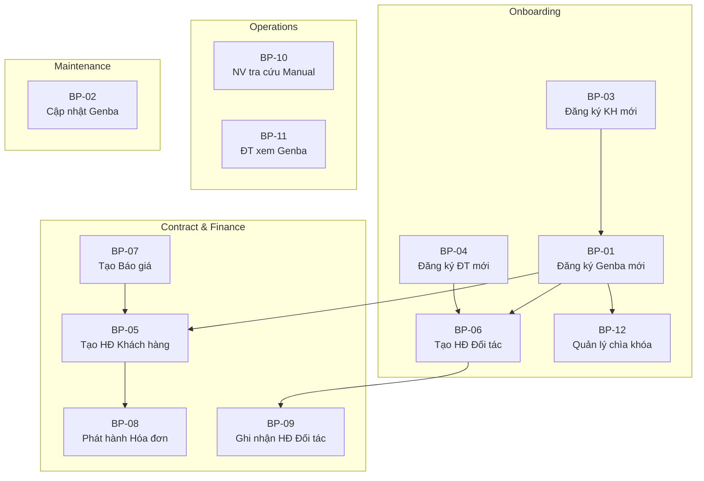

# PHÂN TÍCH NGHIỆP VỤ TOÀN DIỆN - HỆ THỐNG QUẢN LÝ GENBA (Phần 2)

**Phiên bản:** 1.0  
**Ngày tạo:** 2026-06-09  
**Trạng thái:** Draft — Chờ review  

---

## MỤC LỤC (Phần 2)

8. [Business Process](#8-business-process)
9. [Use Case List](#9-use-case-list)
10. [Detailed Use Cases](#10-detailed-use-cases)
11. [Functional Requirements](#11-functional-requirements)

---

## 8. Business Process

### BP-01: Đăng ký Genba mới

| Thuộc tính | Nội dung |
|------------|----------|
| **Process ID** | BP-01 |
| **Process Name** | Đăng ký Genba mới (新規現場登録) |
| **Trigger** | Công ty Shinsei ký hợp đồng mới với khách hàng cho một công trình mới |
| **Actor** | Internal Staff (ACT-02), System Admin (ACT-01) |

**Main Flow:**

```
1. Internal Staff nhận thông tin genba mới từ khách hàng
2. Internal Staff kiểm tra khách hàng đã tồn tại trong hệ thống chưa
   2a. Nếu chưa → tạo mới Customer (BP-03)
3. Internal Staff tạo Genba mới với thông tin cơ bản:
   - Tên công trình (物件名)
   - Địa chỉ (住所)
   - Phương tiện giao thông (交通機関)
   - Loại dịch vụ (日常清掃, 管理員, 定期清掃...)
   - Mức ưu tiên (優先順位)
4. Internal Staff gán Genba cho Customer
5. Internal Staff gán mình làm người phụ trách (担当)
6. Internal Staff thiết lập lịch làm việc (Schedule):
   - Ngày làm việc trong tuần
   - Giờ bắt đầu/kết thúc
   - Số lần/tuần, số giờ/ngày
   - Quy định nghỉ lễ/Obon/Tết
7. Internal Staff nhập thông tin chìa khóa (nếu có)
8. Internal Staff tạo manual vận hành:
   - Hướng dẫn ra/vào tòa nhà (入退館)
   - Manual vệ sinh hằng ngày (日常マニュアル)
   - Manual vệ sinh định kỳ (定期マニュアル)
9. Internal Staff upload ảnh hiện trường
10. Internal Staff tạo hợp đồng liên kết với genba (BP-05)
11. System lưu Genba với trạng thái "Đang hoạt động"
12. System cập nhật cờ "現場確認" và "マニュアル作成"
```

**Alternative Flow:**

```
2a. Khách hàng chưa tồn tại → chuyển sang BP-03 (Đăng ký Khách hàng mới)
    Sau khi hoàn tất → quay lại bước 3
6a. Genba có nhiều ca làm việc → nhập nhiều khung giờ
    (VD: ca cơ bản + ca riêng theo ngày cụ thể)
7a. Genba không có chìa khóa → bỏ qua bước này
8a. Chưa có đủ thông tin manual → tạo Genba trước, 
    bổ sung manual sau → cờ "マニュアル作成" = chưa hoàn thành
```

**Result:**
- Genba mới được tạo trong hệ thống với đầy đủ thông tin cơ bản
- Manual vận hành được tạo (hoặc đánh dấu chưa hoàn thành)
- Genba được liên kết với Customer và Internal Staff phụ trách

---

### BP-02: Cập nhật thông tin Genba

| Thuộc tính | Nội dung |
|------------|----------|
| **Process ID** | BP-02 |
| **Process Name** | Cập nhật thông tin Genba (現場情報更新) |
| **Trigger** | Thay đổi thông tin genba: chìa khóa mới, lịch làm việc thay đổi, hướng dẫn ra/vào thay đổi, genba kết thúc |
| **Actor** | Internal Staff (ACT-02) |

**Main Flow:**

```
1. Internal Staff mở trang chi tiết Genba
2. Internal Staff chỉnh sửa thông tin cần thay đổi
3. System validate dữ liệu đầu vào
4. System lưu thay đổi và ghi nhận lịch sử cập nhật (作成更新日)
5. System cập nhật thời gian "作成更新日" trên manual
```

**Alternative Flow:**

```
2a. Genba kết thúc hợp đồng → Internal Staff chuyển trạng thái 
    sang "Đã kết thúc" (終了現場)
    → System chuyển genba sang trang/danh sách "終了現場用の移行ページ"
    → Dữ liệu được lưu trữ nhưng không hiển thị ở danh sách chính
```

**Result:**
- Thông tin genba được cập nhật; lịch sử thay đổi được ghi nhận

---

### BP-03: Đăng ký Khách hàng mới

| Thuộc tính | Nội dung |
|------------|----------|
| **Process ID** | BP-03 |
| **Process Name** | Đăng ký Khách hàng mới (新規取引先登録) |
| **Trigger** | Ký kết làm việc với một khách hàng mới chưa có trong hệ thống |
| **Actor** | Internal Staff (ACT-02), System Admin (ACT-01) |

**Main Flow:**

```
1. Internal Staff truy cập chức năng tạo mới Customer
2. Internal Staff nhập thông tin công ty khách hàng:
   - Tên công ty đầy đủ (VD: 日本ハウズイング株式会社)
   - Tên rút gọn/chi nhánh (VD: ハウズビル不, ハウズ大阪北)
   - Thông tin liên hệ chung (SĐT, email, địa chỉ)
3. Internal Staff thêm người liên hệ phía khách hàng (Customer Contact):
   - Họ tên (VD: 樋口, 高木)
   - Số điện thoại
   - Email
   - Ghi chú
4. System validate dữ liệu (kiểm tra trùng lặp tên công ty)
5. System lưu Customer mới
```

**Alternative Flow:**

```
3a. Một Customer có nhiều người liên hệ → lặp bước 3
    (VD: 日本ハウズイング có nhiều chi nhánh, mỗi chi nhánh có người liên hệ riêng)
4a. Tên công ty trùng → System cảnh báo; Internal Staff xác nhận 
    tạo mới hoặc chọn công ty đã có
```

**Result:**
- Khách hàng mới được tạo với đầy đủ thông tin liên hệ

---

### BP-04: Đăng ký Công ty đối tác mới

| Thuộc tính | Nội dung |
|------------|----------|
| **Process ID** | BP-04 |
| **Process Name** | Đăng ký Công ty đối tác mới (新規協力会社登録) |
| **Trigger** | Shinsei bắt đầu hợp tác với một công ty đối tác mới |
| **Actor** | Internal Staff (ACT-02), System Admin (ACT-01) |

**Main Flow:**

```
1. Internal Staff truy cập chức năng tạo mới Partner Company
2. Internal Staff nhập thông tin đối tác:
   - Tên công ty (VD: BePro, マルクリーン, エーワイ)
   - Thông tin liên hệ (SĐT, email, địa chỉ)
   - Ghi chú
3. System validate dữ liệu (kiểm tra trùng lặp)
4. System lưu Partner Company mới
5. System Admin (hoặc Internal Staff) tạo tài khoản cho đối tác (nếu cần truy cập hệ thống)
```

**Alternative Flow:**

```
5a. Đối tác không cần truy cập hệ thống → bỏ qua bước tạo tài khoản
```

**Result:**
- Đối tác mới được tạo, sẵn sàng được gán vào genba/hợp đồng

---

### BP-05: Tạo Hợp đồng với Khách hàng

| Thuộc tính | Nội dung |
|------------|----------|
| **Process ID** | BP-05 |
| **Process Name** | Tạo Hợp đồng nhận từ Khách hàng (受注契約作成) |
| **Trigger** | Ký kết hợp đồng mới với khách hàng cho một genba |
| **Actor** | Internal Staff (ACT-02) |

**Main Flow:**

```
1. Internal Staff chọn Genba cần tạo hợp đồng
2. Internal Staff chọn Customer liên quan (nếu chưa gán)
3. Internal Staff nhập thông tin hợp đồng:
   - Mã hợp đồng
   - Loại dịch vụ (日常清掃, 定期清掃, 管理員...)
   - Số tiền hợp đồng (御請求額)
   - Đơn giá giờ (時間単価)
   - Ngày bắt đầu hợp đồng (契約開始)
   - Thời hạn hợp đồng (ngày kết thúc)
   - Trạng thái phát hành hóa đơn (請求書発行有無)
   - Mã MCD (nếu có)
4. System validate: genba phải thuộc đúng customer
5. System lưu hợp đồng và liên kết với Genba + Customer
```

**Alternative Flow:**

```
3a. Một genba có nhiều hợp đồng cho nhiều loại dịch vụ khác nhau
    VD: 1 genba có HĐ 日常清掃 + HĐ 定期清掃
    → Internal Staff tạo nhiều hợp đồng riêng biệt cho cùng 1 genba
3b. Hợp đồng gia hạn → Internal Staff tạo hợp đồng mới 
    với ngày bắt đầu kế tiếp, đánh dấu hợp đồng cũ là "Hết hạn"
```

**Result:**
- Hợp đồng được tạo, liên kết chính xác với Genba và Customer

---

### BP-06: Tạo Hợp đồng với Đối tác

| Thuộc tính | Nội dung |
|------------|----------|
| **Process ID** | BP-06 |
| **Process Name** | Tạo Hợp đồng giao cho Đối tác (発注契約作成) |
| **Trigger** | Shinsei giao thầu phụ một phần công việc tại genba cho đối tác |
| **Actor** | Internal Staff (ACT-02) |

**Main Flow:**

```
1. Internal Staff chọn Genba cần giao thầu phụ
2. Internal Staff chọn Partner Company
3. Internal Staff nhập thông tin hợp đồng:
   - Mã hợp đồng
   - Phạm vi công việc (VD: 定期清掃 toàn bộ, 日常清掃 một phần)
   - Số tiền
   - Ngày bắt đầu / Thời hạn
4. System validate: đối tác chưa có hợp đồng trùng cho cùng genba & dịch vụ
5. System lưu hợp đồng giao, liên kết Genba + Partner
6. System cập nhật thông tin "定期" (đối tác phụ trách) trên Genba
```

**Alternative Flow:**

```
2a. Một genba sử dụng nhiều đối tác (VD: "BePro/ビルテック")
    → Tạo nhiều hợp đồng giao riêng cho từng đối tác
6a. Đối tác cần truy cập hệ thống để xem genba
    → Admin phân quyền genba cho tài khoản đối tác
```

**Result:**
- Hợp đồng giao được tạo; đối tác có thể được cấp quyền xem genba liên quan

---

### BP-07: Tạo Báo giá

| Thuộc tính | Nội dung |
|------------|----------|
| **Process ID** | BP-07 |
| **Process Name** | Tạo Báo giá (見積書作成) |
| **Trigger** | Khách hàng yêu cầu báo giá cho dịch vụ vệ sinh tại genba |
| **Actor** | Internal Staff (ACT-02) |

**Main Flow:**

```
1. Internal Staff truy cập chức năng tạo báo giá
2. Internal Staff chọn Genba và Customer liên quan
3. Internal Staff nhập thông tin báo giá:
   - Tên công việc (VD: "岡三証券 日常清掃作業費")
   - Ngày lập báo giá
   - Hạng mục & đơn giá:
     * Tên tác vụ (VD: "日常清掃作業費")
     * Số lượng (VD: 1 日)
     * Đơn giá (VD: ¥4,000)
   - Chu kỳ công việc (VD: 月～金、祝日は休み)
   - Thời gian (VD: 16:00～18:00, 2.0h × 1名)
   - Nội dung chi tiết (VD: "別紙添付『日常清掃作業基準表』の通り")
   - Điều kiện đặc biệt (VD: thời hạn giới hạn, vật tư do khách cung cấp)
   - Tổng tiền (thuế riêng / thuế gộp)
4. System tính toán tổng tiền
5. Internal Staff xác nhận và lưu báo giá
```

**Alternative Flow:**

```
3a. Báo giá có nhiều hạng mục → lặp bước nhập hạng mục
5a. Khách hàng chấp nhận báo giá → Internal Staff chuyển 
    trạng thái sang "Đã chấp nhận" → có thể tạo Hợp đồng từ báo giá (BP-05)
5b. Khách hàng từ chối → Internal Staff chuyển trạng thái sang "Từ chối"
5c. Cần chỉnh sửa → Internal Staff tạo phiên bản mới (revision)
```

**Result:**
- Báo giá được tạo, liên kết với Genba; có thể chuyển thành hợp đồng

---

### BP-08: Phát hành Hóa đơn cho Khách hàng

| Thuộc tính | Nội dung |
|------------|----------|
| **Process ID** | BP-08 |
| **Process Name** | Phát hành Hóa đơn cho Khách hàng (請求書発行) |
| **Trigger** | Đến kỳ thanh toán hàng tháng theo hợp đồng |
| **Actor** | Internal Staff (ACT-02) |

**Main Flow:**

```
1. Internal Staff truy cập chức năng tạo hóa đơn
2. Internal Staff chọn Hợp đồng (hoặc Genba) cần phát hành hóa đơn
3. System hiển thị thông tin hợp đồng: số tiền (請求額), Customer
4. Internal Staff nhập/xác nhận:
   - Ngày lập hóa đơn
   - Số tiền (có thể điều chỉnh nếu khác hợp đồng)
   - Kỳ thanh toán (tháng)
   - Ghi chú
5. System validate: hợp đồng phải có cờ "請求書発行有無" = 有
6. System lưu hóa đơn với trạng thái "Đã phát hành"
```

**Alternative Flow:**

```
2a. Phát hành hóa đơn cho nhiều genba cùng 1 Customer 
    → Internal Staff chọn nhiều hợp đồng → System tạo hóa đơn tổng hợp
5a. Hợp đồng không cần phát hành hóa đơn (請求書発行有無 = 無)
    → System cảnh báo; Internal Staff xác nhận hoặc hủy
```

**Result:**
- Hóa đơn được tạo và liên kết với hợp đồng; sẵn sàng gửi cho khách hàng

---

### BP-09: Ghi nhận Hóa đơn từ Đối tác

| Thuộc tính | Nội dung |
|------------|----------|
| **Process ID** | BP-09 |
| **Process Name** | Ghi nhận Hóa đơn từ Đối tác (協力会社請求書受領) |
| **Trigger** | Nhận hóa đơn từ đối tác cho công việc đã thực hiện |
| **Actor** | Internal Staff (ACT-02) |

**Main Flow:**

```
1. Internal Staff nhận hóa đơn từ đối tác (giấy/email/fax)
2. Internal Staff truy cập chức năng ghi nhận hóa đơn nhận
3. Internal Staff chọn Partner Company và Hợp đồng giao liên quan
4. Internal Staff nhập:
   - Ngày nhận hóa đơn
   - Số tiền
   - Kỳ thanh toán
   - Upload file hóa đơn gốc (nếu có)
5. System lưu hóa đơn nhận, liên kết với hợp đồng giao
```

**Alternative Flow:**

```
3a. Đối tác gửi hóa đơn tổng cho nhiều genba 
    → Internal Staff phân bổ số tiền theo từng genba/hợp đồng
```

**Result:**
- Hóa đơn từ đối tác được ghi nhận, phục vụ cho đối soát & P&L

---

### BP-10: Tra cứu thông tin Genba (bởi nhân viên hiện trường)

| Thuộc tính | Nội dung |
|------------|----------|
| **Process ID** | BP-10 |
| **Process Name** | Tra cứu Manual vận hành Genba (現場マニュアル参照) |
| **Trigger** | Nhân viên hiện trường cần xem thông tin trước/trong khi làm việc |
| **Actor** | Genba Worker (ACT-03) |

**Main Flow:**

```
1. Genba Worker đăng nhập hệ thống (trên điện thoại hoặc máy tính)
2. System hiển thị danh sách genba mà Worker được phân công
3. Worker chọn genba cần tra cứu
4. System hiển thị trang chi tiết genba:
   - Thông tin cơ bản (địa chỉ, giao thông)
   - Hướng dẫn ra/vào tòa nhà
   - Thông tin chìa khóa (mã cửa, keybanker)
   - Manual vệ sinh hàng ngày (lịch trình theo giờ)
   - Ảnh hiện trường
   - Ghi chú quan trọng
5. Worker xem thông tin cần thiết
```

**Alternative Flow:**

```
2a. Worker chỉ được phân công 1 genba → System hiển thị trực tiếp
3a. Worker tìm kiếm bằng tên genba → System lọc trong phạm vi được phân quyền
```

**Result:**
- Nhân viên hiện trường tra cứu được manual vận hành nhanh chóng

---

### BP-11: Đối tác xem thông tin Genba được phân quyền

| Thuộc tính | Nội dung |
|------------|----------|
| **Process ID** | BP-11 |
| **Process Name** | Đối tác xem Genba được phân quyền (協力会社現場参照) |
| **Trigger** | Đối tác cần xem thông tin genba mà họ được giao |
| **Actor** | Partner Company (ACT-06) |

**Main Flow:**

```
1. Partner Company đăng nhập hệ thống bằng tài khoản được cấp
2. System xác định đối tác thuộc công ty nào
3. System hiển thị CHỈNH danh sách genba có hợp đồng giao với đối tác này
4. Partner chọn genba → xem thông tin:
   - Thông tin cơ bản (địa chỉ, giao thông)
   - Phạm vi công việc theo hợp đồng giao
   - Manual liên quan đến phần công việc được giao 
     (VD: chỉ xem 定期マニュアル nếu HĐ là 定期清掃)
5. Partner KHÔNG thể xem: hợp đồng của Shinsei với khách hàng, 
   hóa đơn, thông tin tài chính, genba không liên quan
```

**Alternative Flow:**

```
3a. Đối tác không có hợp đồng nào đang hoạt động → hiển thị thông báo trống
```

**Result:**
- Đối tác chỉ xem được thông tin genba trong phạm vi được phân quyền

---

### BP-12: Quản lý Chìa khóa

| Thuộc tính | Nội dung |
|------------|----------|
| **Process ID** | BP-12 |
| **Process Name** | Quản lý chìa khóa Genba (鍵管理) |
| **Trigger** | Genba mới, thay đổi chìa khóa, hoặc thu hồi chìa khóa |
| **Actor** | Internal Staff (ACT-02) |

**Main Flow:**

```
1. Internal Staff truy cập Genba → phần quản lý chìa khóa
2. Internal Staff thêm mới hoặc cập nhật chìa khóa:
   - Số thứ tự (NO.)
   - Hình dạng: シリンダー (cylinder) hoặc カード (card)
   - Mã số chìa khóa (VD: "WEST", "OS 113734")
   - Nơi sử dụng (VD: "エントランス・火災受診室・ゴミ庫")
   - Nơi bảo quản: 清掃員 / 会社 / 現場
   - Thông tin keybanker: mã số, vị trí
3. System validate và lưu
4. System ghi nhận lịch sử thay đổi chìa khóa
```

**Alternative Flow:**

```
2a. Thu hồi chìa khóa (genba kết thúc) → đánh dấu trạng thái "Đã thu hồi"
2b. Thay đổi mã keybanker → cập nhật mã mới, System ghi log thay đổi
```

**Result:**
- Thông tin chìa khóa được quản lý tập trung, có lịch sử thay đổi

---

### Tổng quan quy trình nghiệp vụ



---

## 9. Use Case List

| UC ID | Use Case | Actor | Priority |
|-------|----------|-------|----------|
| **— Genba Management —** | | | |
| UC-01 | Tạo mới Genba | Internal Staff | P0 |
| UC-02 | Xem danh sách Genba | Internal Staff, Admin | P0 |
| UC-03 | Xem chi tiết Genba | Internal Staff, Genba Worker, Customer, Partner | P0 |
| UC-04 | Cập nhật thông tin Genba | Internal Staff | P0 |
| UC-05 | Chuyển Genba sang trạng thái "Kết thúc" | Internal Staff | P1 |
| UC-06 | Tìm kiếm/Lọc Genba | Internal Staff, Admin | P0 |
| UC-07 | Xem danh sách Genba đã kết thúc | Internal Staff | P2 |
| **— Customer Management —** | | | |
| UC-08 | Tạo mới Customer | Internal Staff, Admin | P0 |
| UC-09 | Xem danh sách Customer | Internal Staff, Admin | P0 |
| UC-10 | Cập nhật Customer | Internal Staff | P1 |
| UC-11 | Thêm Customer Contact | Internal Staff | P0 |
| UC-12 | Cập nhật Customer Contact | Internal Staff | P1 |
| UC-13 | Tìm kiếm Customer | Internal Staff | P1 |
| **— Partner Management —** | | | |
| UC-14 | Tạo mới Partner Company | Internal Staff, Admin | P1 |
| UC-15 | Xem danh sách Partner Company | Internal Staff, Admin | P1 |
| UC-16 | Cập nhật Partner Company | Internal Staff | P1 |
| UC-17 | Tìm kiếm Partner Company | Internal Staff | P2 |
| **— Staff & Worker Management —** | | | |
| UC-18 | Quản lý Internal Staff | Admin | P1 |
| UC-19 | Gán Internal Staff phụ trách Genba | Internal Staff, Admin | P1 |
| UC-20 | Thêm Genba Worker vào Genba | Internal Staff | P1 |
| UC-21 | Cập nhật Genba Worker | Internal Staff | P1 |
| UC-22 | Xem danh sách Worker theo Genba | Internal Staff | P1 |
| **— Contract Management —** | | | |
| UC-23 | Tạo Hợp đồng nhận (từ KH) | Internal Staff | P0 |
| UC-24 | Tạo Hợp đồng giao (cho ĐT) | Internal Staff | P1 |
| UC-25 | Xem danh sách Hợp đồng | Internal Staff, Admin | P0 |
| UC-26 | Xem chi tiết Hợp đồng | Internal Staff, Customer, Partner | P0 |
| UC-27 | Cập nhật Hợp đồng | Internal Staff | P1 |
| UC-28 | Gia hạn/Kết thúc Hợp đồng | Internal Staff | P1 |
| **— Quotation Management —** | | | |
| UC-29 | Tạo Báo giá | Internal Staff | P1 |
| UC-30 | Xem danh sách Báo giá | Internal Staff | P1 |
| UC-31 | Cập nhật trạng thái Báo giá | Internal Staff | P1 |
| **— Invoice Management —** | | | |
| UC-32 | Tạo Hóa đơn gửi KH | Internal Staff | P1 |
| UC-33 | Ghi nhận Hóa đơn từ ĐT | Internal Staff | P1 |
| UC-34 | Xem danh sách Hóa đơn | Internal Staff, Admin | P1 |
| UC-35 | Cập nhật trạng thái Hóa đơn | Internal Staff | P2 |
| **— Manual & Instruction —** | | | |
| UC-36 | Tạo/Sửa hướng dẫn Ra/Vào (入退館) | Internal Staff | P0 |
| UC-37 | Tạo/Sửa Manual vệ sinh hằng ngày | Internal Staff | P0 |
| UC-38 | Tạo/Sửa Manual vệ sinh định kỳ | Internal Staff | P1 |
| UC-39 | Tạo/Sửa Ghi chú/Memo | Internal Staff | P1 |
| **— Key Management —** | | | |
| UC-40 | Thêm/Sửa thông tin Chìa khóa | Internal Staff | P1 |
| UC-41 | Xem thông tin Chìa khóa Genba | Internal Staff, Genba Worker | P1 |
| **— Document & Photo —** | | | |
| UC-42 | Upload ảnh hiện trường | Internal Staff | P1 |
| UC-43 | Xem ảnh hiện trường | Internal Staff, Genba Worker | P1 |
| UC-44 | Upload tài liệu đính kèm | Internal Staff | P2 |
| **— Authentication —** | | | |
| UC-45 | Đăng nhập | All Actors | P0 |
| UC-46 | Quản lý tài khoản người dùng | Admin | P0 |
| UC-47 | Phân quyền truy cập Genba | Admin | P0 |

---

## 10. Detailed Use Cases

### UC-01: Tạo mới Genba

| Thuộc tính | Nội dung |
|------------|----------|
| **UC ID** | UC-01 |
| **Use Case** | Tạo mới Genba |
| **Actor** | Internal Staff |
| **Goal** | Đăng ký một công trình mới vào hệ thống với đầy đủ thông tin cơ bản |

**Preconditions:**
- Internal Staff đã đăng nhập hệ thống
- Customer liên quan đã tồn tại trong hệ thống (hoặc sẽ tạo trong luồng)

**Main Flow:**

| Step | Actor | Action | System Response |
|------|-------|--------|-----------------|
| 1 | Staff | Chọn "Tạo mới Genba" | Hiển thị form tạo Genba |
| 2 | Staff | Nhập tên công trình (物件名) | — |
| 3 | Staff | Nhập địa chỉ (住所) | — |
| 4 | Staff | Nhập thông tin giao thông (交通機関) | — |
| 5 | Staff | Chọn Customer từ dropdown | Hiển thị danh sách Customer |
| 6 | Staff | Chọn loại dịch vụ (日常清掃, 管理員...) | — |
| 7 | Staff | Chọn mức ưu tiên (A, 代行無...) | — |
| 8 | Staff | Thiết lập lịch làm việc (ngày, giờ, nghỉ lễ) | — |
| 9 | Staff | Nhập ghi chú đặc biệt (nếu có) | — |
| 10 | Staff | Nhấn "Lưu" | Validate dữ liệu → Lưu Genba mới → Hiển thị trang chi tiết |

**Alternative Flow:**

| Điều kiện | Flow |
|-----------|------|
| 5a. Customer chưa tồn tại | Hiển thị nút "Tạo Customer mới" → chuyển sang UC-08 → sau khi tạo xong, quay lại form genba với Customer đã chọn |
| 8a. Nhiều ca làm việc | Staff thêm nhiều khung giờ (tối đa 3 ca theo template hiện tại) |

**Exception Flow:**

| Điều kiện | Flow |
|-----------|------|
| E1. Tên genba trùng lặp | System cảnh báo "Genba với tên tương tự đã tồn tại" → Staff xác nhận tạo mới hoặc hủy |
| E2. Trường bắt buộc bị thiếu | System highlight trường thiếu, không cho lưu |
| E3. Lỗi hệ thống | Hiển thị thông báo lỗi, dữ liệu form được giữ nguyên |

**Post Conditions:**
- Genba mới được tạo trong hệ thống với trạng thái "Đang hoạt động"
- Genba được liên kết với Customer được chọn
- Staff tạo genba tự động được gán làm người phụ trách (担当)
- Cờ "マニュアル作成" = chưa hoàn thành (do manual chưa được tạo)

---

### UC-03: Xem chi tiết Genba

| Thuộc tính | Nội dung |
|------------|----------|
| **UC ID** | UC-03 |
| **Use Case** | Xem chi tiết Genba |
| **Actor** | Internal Staff, Genba Worker, Customer, Partner |
| **Goal** | Xem toàn bộ thông tin liên quan đến một genba cụ thể |

**Preconditions:**
- Actor đã đăng nhập
- Actor có quyền truy cập genba được chọn

**Main Flow:**

| Step | Actor | Action | System Response |
|------|-------|--------|-----------------|
| 1 | Actor | Chọn genba từ danh sách | Hiển thị trang chi tiết genba |
| 2 | — | — | Hiển thị các tab/section: |
| | | | • **Cơ bản**: tên, địa chỉ, giao thông, loại DV, lịch LV, ghi chú |
| | | | • **Chìa khóa**: danh sách key, mã cửa, keybanker |
| | | | • **Manual ra/vào**: hướng dẫn nhập/xuất tòa nhà |
| | | | • **Manual hằng ngày**: lịch trình theo giờ |
| | | | • **Manual định kỳ**: lịch 12 tháng + chi tiết tác vụ |
| | | | • **Ghi chú**: memo, lịch sử sự kiện |
| | | | • **Ảnh**: ảnh hiện trường theo phân loại |
| | | | • **Hợp đồng**: danh sách HĐ liên kết |
| | | | • **Nhân viên**: danh sách worker tại genba |
| 3 | Actor | Chọn tab cần xem | Hiển thị nội dung tab |

**Alternative Flow:**

| Điều kiện | Flow |
|-----------|------|
| 1a. Actor là Genba Worker | System chỉ hiển thị: Cơ bản, Chìa khóa, Manual ra/vào, Manual hằng ngày, Ảnh, Ghi chú. KHÔNG hiển thị: Hợp đồng, Hóa đơn, thông tin tài chính |
| 1b. Actor là Customer | System chỉ hiển thị: Cơ bản (không bao gồm thông tin chìa khóa), Hợp đồng nhận, thông tin liên hệ |
| 1c. Actor là Partner | System chỉ hiển thị: Cơ bản, Manual liên quan đến phạm vi công việc được giao (VD: chỉ 定期マニュアル nếu HĐ giao là 定期清掃) |

**Exception Flow:**

| Điều kiện | Flow |
|-----------|------|
| E1. Actor không có quyền | System hiển thị "Bạn không có quyền truy cập genba này" |
| E2. Genba không tồn tại | System hiển thị "Genba không tìm thấy" |

**Post Conditions:**
- Actor xem được thông tin genba trong phạm vi quyền hạn của mình
- System ghi nhận audit log (ai xem, lúc nào)

---

### UC-23: Tạo Hợp đồng nhận (từ Khách hàng)

| Thuộc tính | Nội dung |
|------------|----------|
| **UC ID** | UC-23 |
| **Use Case** | Tạo Hợp đồng nhận từ Khách hàng |
| **Actor** | Internal Staff |
| **Goal** | Ghi nhận hợp đồng mà Shinsei nhận từ khách hàng cho một genba |

**Preconditions:**
- Internal Staff đã đăng nhập
- Genba và Customer đã tồn tại trong hệ thống

**Main Flow:**

| Step | Actor | Action | System Response |
|------|-------|--------|-----------------|
| 1 | Staff | Chọn Genba → tab Hợp đồng → "Tạo HĐ mới" | Hiển thị form tạo hợp đồng |
| 2 | — | — | Tự động điền Customer từ genba |
| 3 | Staff | Nhập mã hợp đồng | — |
| 4 | Staff | Chọn loại dịch vụ | — |
| 5 | Staff | Nhập số tiền (御請求額) | — |
| 6 | Staff | Nhập đơn giá giờ (時間単価) | — |
| 7 | Staff | Nhập ngày bắt đầu (契約開始) | — |
| 8 | Staff | Nhập thời hạn/ngày kết thúc | — |
| 9 | Staff | Chọn trạng thái phát hành hóa đơn (有/無) | — |
| 10 | Staff | Nhập mã MCD (nếu có) | — |
| 11 | Staff | Nhấn "Lưu" | Validate → Lưu HĐ → Liên kết Genba + Customer |

**Alternative Flow:**

| Điều kiện | Flow |
|-----------|------|
| 4a. Genba đã có HĐ cùng loại dịch vụ | System cảnh báo "Genba đã có HĐ [loại DV]. Bạn muốn tạo HĐ mới hay cập nhật HĐ hiện tại?" |
| 11a. Tạo từ Báo giá đã chấp nhận | System tự động điền thông tin từ báo giá (giá, loại DV, điều kiện) |

**Exception Flow:**

| Điều kiện | Flow |
|-----------|------|
| E1. Mã HĐ trùng | System báo lỗi "Mã hợp đồng đã tồn tại" |
| E2. Ngày kết thúc < Ngày bắt đầu | System báo lỗi validate |

**Post Conditions:**
- Hợp đồng nhận được tạo, liên kết với Genba và Customer
- Hợp đồng có trạng thái "Đang hiệu lực"
- Thông tin tài chính (請求額, 時間単価) được ghi nhận

---

### UC-36: Tạo/Sửa hướng dẫn Ra/Vào (入退館)

| Thuộc tính | Nội dung |
|------------|----------|
| **UC ID** | UC-36 |
| **Use Case** | Tạo/Sửa hướng dẫn Ra/Vào tòa nhà |
| **Actor** | Internal Staff |
| **Goal** | Ghi nhận chi tiết quy trình vào/ra tòa nhà cho nhân viên hiện trường |

**Preconditions:**
- Internal Staff đã đăng nhập
- Genba đã tồn tại

**Main Flow:**

| Step | Actor | Action | System Response |
|------|-------|--------|-----------------|
| 1 | Staff | Chọn Genba → tab "Hướng dẫn ra/vào" | Hiển thị nội dung hiện tại (hoặc form trống) |
| 2 | Staff | Nhập/sửa hướng dẫn vào (入館方法): | — |
| | | Từng bước chi tiết dạng rich text | |
| | | VD: "玄関 → 呼1513で開錠" | |
| | | VD: "キーバンカーあり。ダイヤルを8909に合わし..." | |
| 3 | Staff | Nhập/sửa hướng dẫn ra (退館方法): | — |
| | | VD: "鍵をキーバンカーに入れ退出" | |
| 4 | Staff | Nhập lưu ý quan trọng (cảnh báo) | — |
| | | VD: "オートロックなのでインキーに注意！" | |
| | | VD: "車の通行が多いので安全に注意" | |
| 5 | Staff | Nhấn "Lưu" | Validate → Lưu → Cập nhật 作成更新日 |

**Alternative Flow:**

| Điều kiện | Flow |
|-----------|------|
| 1a. Manual đã tồn tại | Hiển thị nội dung hiện tại ở chế độ edit |

**Exception Flow:** Không có exception đặc biệt

**Post Conditions:**
- Hướng dẫn ra/vào được lưu cho genba
- Ngày cập nhật (作成更新日) được ghi nhận
- Genba Worker và Partner (nếu được phân quyền) có thể xem nội dung này

---

### UC-37: Tạo/Sửa Manual vệ sinh hằng ngày

| Thuộc tính | Nội dung |
|------------|----------|
| **UC ID** | UC-37 |
| **Use Case** | Tạo/Sửa Manual vệ sinh hằng ngày (日常清掃マニュアル) |
| **Actor** | Internal Staff |
| **Goal** | Ghi nhận lịch trình và nội dung công việc hằng ngày theo khung giờ |

**Preconditions:**
- Internal Staff đã đăng nhập
- Genba đã tồn tại

**Main Flow:**

| Step | Actor | Action | System Response |
|------|-------|--------|-----------------|
| 1 | Staff | Chọn Genba → tab "Manual hằng ngày" | Hiển thị bảng lịch trình |
| 2 | Staff | Thêm mục công việc mới: | — |
| | | - Thời gian (VD: 10:00) | |
| | | - Tầng/Vị trí (VD: 1階) | |
| | | - Khu vực (VD: ごみ庫, エントランス) | |
| | | - Nội dung (VD: "ごみ袋の整理。床、水流し") | |
| | | - Ghi chú đặc biệt (VD: "火災受診室に散水栓の鍵あり") | |
| 3 | Staff | Lặp bước 2 cho tất cả khung giờ | — |
| 4 | Staff | Sắp xếp thứ tự theo thời gian | System auto-sort theo giờ |
| 5 | Staff | Nhấn "Lưu" | Validate → Lưu → Cập nhật 作成更新日 |

**Alternative Flow:**

| Điều kiện | Flow |
|-----------|------|
| 2a. Công việc chi tiết phức tạp | Staff nhập dạng rich text với bullet points. VD manual 岡三証券: danh sách dụng cụ cần chuẩn bị, từng bước thực hiện, lưu ý cho từng phòng |
| 2b. Cùng khung giờ, nhiều khu vực | Staff thêm nhiều mục cùng khung giờ, hệ thống gom nhóm theo thời gian |

**Exception Flow:** Không có exception đặc biệt

**Post Conditions:**
- Manual hằng ngày được lưu dưới dạng lịch trình theo giờ
- Nhân viên hiện trường có thể tra cứu

---

### UC-40: Thêm/Sửa thông tin Chìa khóa

| Thuộc tính | Nội dung |
|------------|----------|
| **UC ID** | UC-40 |
| **Use Case** | Thêm/Sửa thông tin chìa khóa |
| **Actor** | Internal Staff |
| **Goal** | Quản lý chìa khóa, thẻ từ, mã cửa tự động cho genba |

**Preconditions:**
- Internal Staff đã đăng nhập
- Genba đã tồn tại

**Main Flow:**

| Step | Actor | Action | System Response |
|------|-------|--------|-----------------|
| 1 | Staff | Chọn Genba → tab "Chìa khóa" | Hiển thị danh sách chìa khóa hiện tại |
| 2 | Staff | Nhấn "Thêm chìa khóa" | Hiển thị form |
| 3 | Staff | Nhập thông tin: | — |
| | | - Hình dạng: シリンダー / カード | |
| | | - Mã số: VD "WEST", "OS 113734" | |
| | | - Nơi sử dụng: VD "エントランス・火災受診室" | |
| | | - Nơi bảo quản: 清掃員 / 会社 / 現場 | |
| 4 | Staff | (Tùy chọn) Nhập thông tin keybanker: | — |
| | | - Mã keybanker: VD "3911" | |
| | | - Vị trí: VD "オービーケー倉庫の郵便受" | |
| | | - Hướng dẫn sử dụng | |
| 5 | Staff | Nhấn "Lưu" | Validate → Lưu → Mã hóa thông tin nhạy cảm |

**Alternative Flow:**

| Điều kiện | Flow |
|-----------|------|
| 2a. Sửa chìa khóa đã có | Staff chọn chìa khóa → sửa → lưu → System ghi log thay đổi |
| 2b. Xóa chìa khóa (thu hồi) | Staff chọn → "Đánh dấu thu hồi" → chìa khóa chuyển sang trạng thái inactive |

**Exception Flow:**

| Điều kiện | Flow |
|-----------|------|
| E1. Vượt quá giới hạn | System cảnh báo nếu số chìa khóa vượt mức (Assumption: không giới hạn cứng, nhưng cảnh báo nếu > 10) |

**Post Conditions:**
- Thông tin chìa khóa được lưu với mã hóa cho dữ liệu nhạy cảm (mã cửa, mã keybanker)
- Lịch sử thay đổi được ghi nhận
- Genba Worker được phân quyền có thể xem thông tin chìa khóa

---

### UC-45: Đăng nhập

| Thuộc tính | Nội dung |
|------------|----------|
| **UC ID** | UC-45 |
| **Use Case** | Đăng nhập |
| **Actor** | All Actors (Admin, Internal Staff, Genba Worker, Customer, Partner) |
| **Goal** | Xác thực người dùng và truy cập hệ thống theo vai trò |

**Preconditions:**
- Actor có tài khoản đã được Admin tạo sẵn
- Actor biết username/password

**Main Flow:**

| Step | Actor | Action | System Response |
|------|-------|--------|-----------------|
| 1 | Actor | Truy cập trang đăng nhập | Hiển thị form đăng nhập |
| 2 | Actor | Nhập username | — |
| 3 | Actor | Nhập password | — |
| 4 | Actor | Nhấn "Đăng nhập" | Xác thực thông tin |
| 5 | — | — | Xác định vai trò (role) của người dùng |
| 6 | — | — | Redirect theo vai trò: |
| | | | • Admin → Dashboard quản trị |
| | | | • Internal Staff → Danh sách Genba (tất cả) |
| | | | • Genba Worker → Danh sách Genba (được phân công) |
| | | | • Customer → Danh sách Genba (của mình) |
| | | | • Partner → Danh sách Genba (được giao) |

**Alternative Flow:**

| Điều kiện | Flow |
|-----------|------|
| 4a. Sai password | System hiển thị "Tài khoản hoặc mật khẩu không chính xác" (không tiết lộ cái nào sai) |
| 4b. Tài khoản bị khóa | System hiển thị "Tài khoản đã bị khóa. Vui lòng liên hệ Admin" |

**Exception Flow:**

| Điều kiện | Flow |
|-----------|------|
| E1. Quá 5 lần sai | System khóa tài khoản tạm thời (15 phút) |
| E2. Tài khoản không tồn tại | Hiển thị cùng message với sai password (bảo mật) |

**Post Conditions:**
- Actor được xác thực và redirect đến trang phù hợp với vai trò
- Session được tạo
- Audit log ghi nhận thời gian đăng nhập

---

### UC-47: Phân quyền truy cập Genba

| Thuộc tính | Nội dung |
|------------|----------|
| **UC ID** | UC-47 |
| **Use Case** | Phân quyền truy cập Genba |
| **Actor** | Admin |
| **Goal** | Kiểm soát ai được xem genba nào — đặc biệt cho Partner và Genba Worker |

**Preconditions:**
- Admin đã đăng nhập
- Genba và User (Partner/Worker) đã tồn tại

**Main Flow:**

| Step | Actor | Action | System Response |
|------|-------|--------|-----------------|
| 1 | Admin | Chọn User cần phân quyền | Hiển thị trang quản lý quyền |
| 2 | Admin | Xem danh sách genba đang được gán | Hiển thị danh sách |
| 3 | Admin | Thêm genba vào phạm vi truy cập: | — |
| | | - Chọn genba từ danh sách | |
| | | - Chọn mức quyền (Xem cơ bản / Xem manual / Xem HĐ) | |
| 4 | Admin | Nhấn "Lưu" | Cập nhật phân quyền |

**Alternative Flow:**

| Điều kiện | Flow |
|-----------|------|
| 3a. Phân quyền theo Partner Company | Admin chọn Partner → System tự động gán tất cả genba có HĐ giao với Partner đó |
| 3b. Thu hồi quyền | Admin xóa genba khỏi phạm vi → User không còn thấy genba đó |

**Exception Flow:**

| Điều kiện | Flow |
|-----------|------|
| E1. Gán genba không có HĐ với Partner | System cảnh báo "Genba không có hợp đồng với đối tác này" |

**Post Conditions:**
- User chỉ nhìn thấy genba trong phạm vi được phân quyền
- Thay đổi có hiệu lực ngay lập tức

---

## 11. Functional Requirements

### Module M-01: Authentication & Authorization

| FR ID | Description | Priority | Related Module |
|-------|-------------|----------|----------------|
| FR-001 | Hệ thống phải cho phép người dùng đăng nhập bằng username/password đã được Admin tạo sẵn | P0 | M-01 |
| FR-002 | Hệ thống phải hỗ trợ 5 vai trò: Admin, Internal Staff, Genba Worker, Customer, Partner Company | P0 | M-01 |
| FR-003 | Hệ thống phải redirect người dùng đến trang phù hợp vai trò sau khi đăng nhập | P0 | M-01 |
| FR-004 | Admin phải có khả năng tạo, sửa, khóa, xóa tài khoản người dùng | P0 | M-01 |
| FR-005 | Hệ thống phải khóa tài khoản tạm thời sau 5 lần đăng nhập thất bại liên tiếp | P1 | M-01 |
| FR-006 | Hệ thống phải hỗ trợ phân quyền truy cập genba theo từng user (đặc biệt cho Partner và Worker) | P0 | M-01 |
| FR-007 | Partner Company chỉ được xem genba có hợp đồng giao với mình | P0 | M-01 |
| FR-008 | Genba Worker chỉ được xem genba mà mình được phân công | P0 | M-01 |
| FR-009 | Hệ thống phải ghi nhận audit log cho mọi thao tác đăng nhập/đăng xuất | P1 | M-01 |

---

### Module M-02: Genba Management

| FR ID | Description | Priority | Related Module |
|-------|-------------|----------|----------------|
| FR-010 | Hệ thống phải cho phép tạo mới genba với các trường: tên (物件名), địa chỉ (住所), giao thông (交通機関), loại dịch vụ, mức ưu tiên, SĐT, ghi chú | P0 | M-02 |
| FR-011 | Hệ thống phải cho phép liên kết genba với đúng 1 Customer | P0 | M-02 |
| FR-012 | Hệ thống phải cho phép gán Internal Staff phụ trách (担当) cho mỗi genba | P0 | M-02 |
| FR-013 | Hệ thống phải hỗ trợ 2 trạng thái genba: "Đang hoạt động" và "Đã kết thúc" (終了現場) | P1 | M-02 |
| FR-014 | Genba đã kết thúc phải được chuyển sang danh sách riêng (終了現場用の移行ページ) nhưng dữ liệu vẫn được lưu trữ | P1 | M-02 |
| FR-015 | Hệ thống phải hiển thị cờ trạng thái "現場確認" và "マニュアル作成" cho mỗi genba | P2 | M-02 |
| FR-016 | Trang chi tiết genba phải hiển thị thông tin theo tabs: Cơ bản, Chìa khóa, Manual ra/vào, Manual hằng ngày, Manual định kỳ, Ghi chú, Ảnh, Hợp đồng, Nhân viên | P0 | M-02 |
| FR-017 | Nội dung hiển thị trên trang chi tiết genba phải được lọc theo vai trò người dùng (Internal Staff xem tất cả; Worker không xem tài chính; Partner chỉ xem phạm vi HĐ) | P0 | M-02, M-01 |

---

### Module M-03: Customer Management

| FR ID | Description | Priority | Related Module |
|-------|-------------|----------|----------------|
| FR-018 | Hệ thống phải cho phép tạo mới Customer với: tên đầy đủ, tên rút gọn/chi nhánh, SĐT, email, địa chỉ | P0 | M-03 |
| FR-019 | Hệ thống phải cho phép thêm nhiều Customer Contact cho mỗi Customer, mỗi contact gồm: họ tên, SĐT, email, ghi chú | P0 | M-03 |
| FR-020 | Hệ thống phải cảnh báo khi tạo Customer có tên trùng hoặc tương tự với Customer đã có | P1 | M-03 |
| FR-021 | Hệ thống phải hiển thị danh sách genba thuộc mỗi Customer | P1 | M-03 |

---

### Module M-04: Partner Company Management

| FR ID | Description | Priority | Related Module |
|-------|-------------|----------|----------------|
| FR-022 | Hệ thống phải cho phép tạo mới Partner Company với: tên, SĐT, email, địa chỉ, ghi chú | P1 | M-04 |
| FR-023 | Hệ thống phải hiển thị danh sách genba có hợp đồng giao cho mỗi Partner | P1 | M-04 |
| FR-024 | Hệ thống phải hỗ trợ trường hợp 1 genba có nhiều Partner (VD: "BePro/ビルテック") | P1 | M-04 |

---

### Module M-05: Staff & Worker Management

| FR ID | Description | Priority | Related Module |
|-------|-------------|----------|----------------|
| FR-025 | Hệ thống phải cho phép quản lý danh sách Internal Staff (担当) với: họ tên, SĐT, email | P1 | M-05 |
| FR-026 | Hệ thống phải cho phép thêm Genba Worker vào genba với: họ tên, SĐT, email, ngày sinh, ghi chú | P1 | M-05 |
| FR-027 | Hệ thống phải hiển thị danh sách genba theo Internal Staff phụ trách | P1 | M-05 |
| FR-028 | Hệ thống phải hiển thị tổng doanh thu phụ trách của mỗi Internal Staff (Assumption: tính từ tổng 請求額 các genba) | P2 | M-05 |

---

### Module M-06: Contract Management

| FR ID | Description | Priority | Related Module |
|-------|-------------|----------|----------------|
| FR-029 | Hệ thống phải hỗ trợ 2 loại hợp đồng: Hợp đồng nhận (受注 — từ KH) và Hợp đồng giao (発注 — cho ĐT) | P0 | M-06 |
| FR-030 | Hợp đồng nhận phải gồm: mã HĐ, loại DV, số tiền (請求額), đơn giá giờ (時間単価), ngày bắt đầu, thời hạn, trạng thái phát hành HĐ (請求書発行有無), mã MCD | P0 | M-06 |
| FR-031 | Hợp đồng giao phải gồm: mã HĐ, phạm vi công việc, số tiền, ngày bắt đầu, thời hạn | P1 | M-06 |
| FR-032 | Một genba phải có thể có nhiều hợp đồng (nhiều loại DV hoặc nhiều kỳ) | P0 | M-06 |
| FR-033 | Hợp đồng phải liên kết chính xác: HĐ nhận ↔ Genba ↔ Customer; HĐ giao ↔ Genba ↔ Partner | P0 | M-06 |
| FR-034 | Hệ thống phải hỗ trợ trạng thái hợp đồng: Đang hiệu lực, Hết hạn, Đã hủy | P1 | M-06 |

---

### Module M-07: Quotation Management

| FR ID | Description | Priority | Related Module |
|-------|-------------|----------|----------------|
| FR-035 | Hệ thống phải cho phép tạo báo giá với: tên công việc, ngày lập, hạng mục (tên, số lượng, đơn vị, đơn giá), tổng tiền | P1 | M-07 |
| FR-036 | Báo giá phải cho phép nhập điều kiện: chu kỳ, thời gian, nội dung chi tiết, điều kiện đặc biệt | P1 | M-07 |
| FR-037 | Hệ thống phải hỗ trợ trạng thái báo giá: Mới tạo, Đã gửi, Chấp nhận, Từ chối | P1 | M-07 |
| FR-038 | Hệ thống phải cho phép tạo hợp đồng từ báo giá đã được chấp nhận | P2 | M-07, M-06 |

---

### Module M-08: Invoice Management

| FR ID | Description | Priority | Related Module |
|-------|-------------|----------|----------------|
| FR-039 | Hệ thống phải hỗ trợ 2 loại hóa đơn: Hóa đơn gửi (cho KH) và Hóa đơn nhận (từ ĐT) | P1 | M-08 |
| FR-040 | Hóa đơn gửi phải gồm: liên kết HĐ, ngày lập, số tiền, kỳ thanh toán, ghi chú | P1 | M-08 |
| FR-041 | Hóa đơn nhận phải cho phép upload file hóa đơn gốc | P2 | M-08 |
| FR-042 | Hệ thống phải kiểm tra cờ "請求書発行有無" trước khi cho phép tạo hóa đơn gửi | P1 | M-08 |
| FR-043 | Hệ thống phải hỗ trợ trạng thái hóa đơn: Nháp, Đã phát hành, Đã thanh toán | P2 | M-08 |

---

### Module M-09: Work Instruction & Manual

| FR ID | Description | Priority | Related Module |
|-------|-------------|----------|----------------|
| FR-044 | Hệ thống phải cho phép tạo/sửa hướng dẫn ra/vào (入退館) cho mỗi genba, hỗ trợ rich text với các bước chi tiết | P0 | M-09 |
| FR-045 | Hệ thống phải cho phép tạo/sửa manual vệ sinh hằng ngày dưới dạng bảng lịch trình: thời gian, vị trí (tầng), khu vực, nội dung công việc, ghi chú đặc biệt | P0 | M-09 |
| FR-046 | Hệ thống phải cho phép tạo/sửa manual vệ sinh định kỳ gồm: lịch 12 tháng (4月～3月) đánh dấu tháng thực hiện; chi tiết tác vụ theo vị trí, chất liệu sàn (材質), nội dung | P1 | M-09 |
| FR-047 | Hệ thống phải cho phép tạo/sửa ghi chú/memo (その他メモ) với thông tin: ngày giờ, nội dung | P1 | M-09 |
| FR-048 | Hệ thống phải ghi nhận và hiển thị ngày cập nhật (作成更新日) cho mỗi manual | P1 | M-09 |

---

### Module M-10: Key Management

| FR ID | Description | Priority | Related Module |
|-------|-------------|----------|----------------|
| FR-049 | Hệ thống phải cho phép quản lý chìa khóa cho mỗi genba với: STT, hình dạng (シリンダー/カード), mã số, nơi sử dụng, nơi bảo quản (清掃員/会社/現場) | P1 | M-10 |
| FR-050 | Hệ thống phải cho phép ghi nhận thông tin keybanker: mã số, vị trí đặt, hướng dẫn sử dụng | P1 | M-10 |
| FR-051 | Hệ thống phải mã hóa thông tin nhạy cảm: mã chìa khóa, mã keybanker, mã cửa | P0 | M-10, M-01 |
| FR-052 | Hệ thống phải ghi nhận lịch sử thay đổi thông tin chìa khóa (ai sửa, lúc nào, giá trị cũ/mới) | P1 | M-10 |

---

### Module M-11: Schedule Management

| FR ID | Description | Priority | Related Module |
|-------|-------------|----------|----------------|
| FR-053 | Hệ thống phải cho phép thiết lập lịch làm việc cho mỗi genba: ngày trong tuần (月～日 + 祝), giờ bắt đầu/kết thúc, thời gian nghỉ | P1 | M-11 |
| FR-054 | Hệ thống phải hỗ trợ nhiều ca làm việc cho 1 genba (tối đa 3 ca theo template hiện tại) | P1 | M-11 |
| FR-055 | Hệ thống phải cho phép thiết lập quy định nghỉ lễ: nghỉ/dồn trước/dồn sau cho ngày lễ; có/không làm Obon; có/không làm Tết | P1 | M-11 |
| FR-056 | Hệ thống phải lưu số lần/tuần (〇回/週) và số giờ/ngày (〇時間/日) | P1 | M-11 |

---

### Module M-12: Document & Photo Management

| FR ID | Description | Priority | Related Module |
|-------|-------------|----------|----------------|
| FR-057 | Hệ thống phải cho phép upload ảnh hiện trường với phân loại (ngoại thất, lối vào, khu vực làm việc, dụng cụ, v.v.) và caption | P1 | M-12 |
| FR-058 | Hệ thống phải hiển thị ảnh theo dạng gallery với caption, tương tự sheet 現場写真 hiện tại | P1 | M-12 |
| FR-059 | Hệ thống phải cho phép upload tài liệu đính kèm (PDF, Excel) cho genba | P2 | M-12 |
| FR-060 | Hệ thống phải giới hạn dung lượng upload phù hợp (Assumption: tối đa 10MB/file, 50MB/genba) | P2 | M-12 |

---

### Module M-13: Search & Filter

| FR ID | Description | Priority | Related Module |
|-------|-------------|----------|----------------|
| FR-061 | Hệ thống phải cho phép tìm kiếm genba theo: tên công trình, địa chỉ, tên khách hàng, tên đối tác, tên nhân viên phụ trách, loại dịch vụ | P1 | M-13 |
| FR-062 | Hệ thống phải cho phép lọc genba theo: trạng thái (đang hoạt động/kết thúc), mức ưu tiên, khách hàng, đối tác, nhân viên phụ trách | P1 | M-13 |

---

> [!NOTE]
> **Phần 2 hoàn tất (Mục 8–11).** Bấm "Tiếp tục" để nhận Phần 3 gồm:
> - Mục 12: Non-Functional Requirements
> - Mục 13: Permission Matrix
> - Mục 14: Data Dictionary
> - Mục 15: Business Rules
> - Mục 16: Risks & Assumptions
> - Mục 17: Open Questions
> - Mục 18: MVP Recommendation
> - Đánh giá độ đầy đủ
